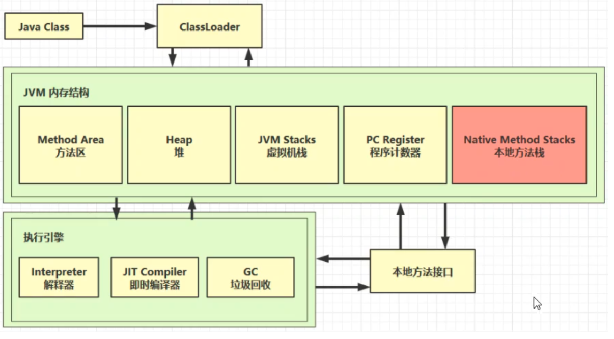

# JVM

- java程序的运行环境（java二进制字节码的运行环境）
- 好处：
  - 异常编写，到处运行
  - 自动内存管理，垃圾回收功能
  - 指针越界检测

## 内存结构

JRE包含了JVM

- .java编译为.class文件，再通过classloader加载
- jvm与java无关，任何语言只要能变成.class文件以后都可以在jvm上执行
- JVM Stacks虚拟机栈：为main主线程、自己创建的线程分配内存，局部变量、方法参数所占用的内存都是这个栈内存，java方法用的是虚拟机栈
- 方法区：存储类的原始信息，包括类的名字、类的继承关系、类的成员变量、类里的引用信息、类的方法代码信息
- 堆：通过new关键字创建的对象，存储类的实例对象信息，计算对象需要占多少字节，从而决定为对象开辟多大的空间
- 本地方法栈：像hashcode这些不能用java直接实现的方法，调用本地方法接口的本地库
- 程序计数器：当前这个线程执行到哪行代码了
- 线程私有：程序计数器、虚拟机栈
- 线程共享：堆、方法区

## 内存溢出

- 除程序计数器外其他内存结构区都会产生内存溢出

### OutOfMemoryError

1. 堆内存耗尽 ---对象越来越多，又一直在使用，不能被垃圾回收
2. 方法区内存耗尽 ---加载的类越来越多，很多框架都会在运行期间动态产生新的类
3. 虚拟机栈累积 ---每个线程最多会占用1M内存，线程个数越来越多，而又长时间运行不销毁时

### StackOverflowError

1. 虚拟机栈内部 ---方法调用次数过多（比如递归）

## 类加载器

1. 虚拟机自带的加载器
2. 启动类（根）加载器
3. 扩展类加载器
4. 应用程序加载器

### 双亲委派机制

APP-->EXC-->BOOT（最终执行）