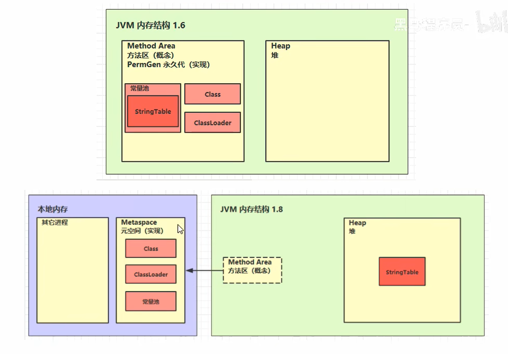

# JVM—内存结构


## 程序计数器

### 作用：

- 记住下一条jvm指令的执行地址

### 特点：

- 线程私有
- 不会出现内存溢出

## 虚拟机栈

- 栈：每个线程运行需要的内存空间

- 栈帧：每个方法运行时需要的内存，每个栈由多个栈帧组成，对应着每次方法调用时所占用的内存
- 每个栈只能有一个活动栈帧，对应着当前正在执行的那个方法

### 问题辨析

1. 垃圾回收是否涉及栈内存？

   不涉及

2. 栈内存分配越大越好么？

   栈内存越大反而会让线程数越少

   通过-Xss指令可以指定栈内存大小

   ```java
   -Xss1024k
   ```

3. 方法内的局部变量是否线程安全？

   - 每个线程都有自己私有的局部变量，静态方法也如此

   - 方法的参数未必是线程安全的

   - 方法的返回值也未必是线程安全的，其他线程可以拿到这个返回值并发的去执行

   <font color='red'>即对于引用对象，作用范围是方法内的局部变量才是线程安全的</font>

### 栈内存溢出Stack Overflow

- 栈帧过多：递归调用未设置结束条件
- 栈帧过大
- 说明：一个线程内的堆内存溢出，它所占据的资源会被立刻释放，不会迫使主线程结束

### 线程运行诊断

1. cpu占用过多
   - 定位：
     - 用top定位哪个进程对cpu的占用过高
     - `ps H -eo pid,tid,%cpu | grep 进程id`(用ps命令进一步定位是哪个线程引起的cpu占用过高)
     - `jstack 进程id`,查看操作系统级别的线程id（nid）的时候需要自行将10进制线程id换算为十六进制，根据线程信息定位到具体的源码行号
2. 程序运行很长时间没有结果（线程死锁）

## 本地方法栈

- C++语言编写的方法在本地方法栈运行，Object的clone、hashCode、notify、notifyAll、wait，由native修饰符修饰的
- 线程私有

## 堆

- 通过new关键字，创建对象都会使用堆内存
- 线程共享的，堆中对象都需要考虑线程安全问题
- 有垃圾回收机制

### 堆内存溢出

- OutOfMemoryError:Java heap space

- 设置堆空间初始内存大小的指令：(默认是4G)

  ```java
  -Xms8m
  ```
  
- 设置堆空间最大内存大小的指令

  ```java
  -Xmx8m
  ```

### 堆内存诊断工具

1. jps工具

   - 查看当前系统中有哪些java进程
   - 在terminal输入jps

2. jmap工具

   - 查看堆内存占用情况，只能查看某个时刻的

   - 对于1.8以上的版本，使用指令查看

     ```java
     jhsdb jmap --heap --pid 进程id
     ```

3. jconsole工具

   - 图形界面的，多功能的监测工具，可以连续监测
   
4. jvisualvm工具 dump堆转储

   - 图形界面的，可以查看为什么会占用那么大的堆内存，是哪个对象占用了那么大的堆内存

## 方法区



- 存储了每个类的结构，例如运行时常量池、变量、方法数据、方法和构造器的代码
- 在虚拟机启动时创建
- 逻辑上是堆的一部分

### 会产生内存溢出

- 1.8以前会导致永久代内存溢出`java.lang.OutOfMemoryError: PermGen space`

- 1.8以后会导致元空间内存溢出`java.lang.OutOfMemoryError: Metaspace`

- 指定元空间大小，默认与电脑系统的内存空间大小一致

  ```java
  -XX:MaxMetaspaceSize=8m
  ```

- 场景：

  - spring cglib代理
  - mybatis 动态加载、生成类

### 运行时常量池

- 反编译指令

  ```java
  javap -v HelloWorld.class
  ```

#### 定义

- 常量池：一张表，虚拟机指令根据这张常量表找到要执行的类名、方法名、参数类型、字面量等信息
- 运行时常量池：常量池是*.class文件中的，当该类被加载，它的常量池信息就会放入运行时常量池，并把里面的符号地址变为真实地址

#### StringTable

- 1.8用的是堆空间
- 1.6用的是永久代

##### 特性

- 常量池中的字符串仅是符号，第一次用到时才变为对象

- 利用串池机制，来避免重复创建字符串对象

- 字符串变量拼接的原理是StringBuilder（1.8）

- 字符串常量拼接的原理是javac编译期优化

- 可以使用intern方法，主动将串池中还没有的字符串对象放入串池

  ```java
      //  ["ab", "a", "b"]
      public static void main(String[] args) {
  
          String x = "ab";
          String s = new String("a") + new String("b");
  
          // 堆  new String("a")   new String("b") new String("ab")
          String s2 = s.intern(); // 将这个字符串对象尝试放入串池，如果有则并不会放入，如果没有则把s放入串池， 会把串池中的对象返回赋予s2
  
          System.out.println( s2 == x);//true
          System.out.println( s == x );//false
      }
  ```

- 字符串字面量也是【延迟】成为对象的

  ```java
  public class TestString {
      public static void main(String[] args) {
          int x = args.length;
          System.out.println(); // 字符串个数 2275
  
          System.out.print("1");
          System.out.print("2");
          System.out.print("3");
          System.out.print("4");
          System.out.print("5");
          System.out.print("6");
          System.out.print("7");
          System.out.print("8");
          System.out.print("9");
          System.out.print("0");
          System.out.print("1"); // 字符串个数 2285
          System.out.print("2");
          System.out.print("3");
          System.out.print("4");
          System.out.print("5");
          System.out.print("6");
          System.out.print("7");
          System.out.print("8");
          System.out.print("9");
          System.out.print("0");
          System.out.print(x); // 字符串个数
      }
  }
  ```

##### 面试题

```java
// StringTable [ "a", "b" ,"ab" ]  hashtable 结构，不能扩容
public class Demo1_22 {
    // 常量池中的信息，都会被加载到运行时常量池中， 这时 a b ab 都是常量池中的符号，还没有变为 java 字符串对象
    // ldc #2 会把 a 符号变为 "a" 字符串对象
    // ldc #3 会把 b 符号变为 "b" 字符串对象
    // ldc #4 会把 ab 符号变为 "ab" 字符串对象

    public static void main(String[] args) {
        String s1 = "a"; // 懒惰的
        String s2 = "b";
        String s3 = "a" + "b";  // javac 在编译期间的优化，结果已经在编译期确定为ab
        String s4 = s1 + s2; // new StringBuilder().append("a").append("b").toString()  new String("ab")在堆中
        String s6 = s4.intern();
        String s5 = "ab";
		System.out.println(s3 == s4);//false
        System.out.println(s3 == s5);//true
        System.out.println(s3 == s6);//true
        
        String x2 = new String("c") + new String("d"); // new String("cd")在堆中
        x2.intern();//将堆中的字符串放入常量池（常量池里没有，将自己地址放入常量池中）
        String x1 = "cd";

// 问，如果调换了【最后两行代码】的位置呢（false），如果是jdk1.6（false）呢
        System.out.println(x1 == x2);//true
    }
}
```

##### 垃圾回收

- StringTable会触发垃圾回收

##### 性能调优

- StringTable是HashTable存储的

- 设置StringTable桶个数，设置时最小不能小于1009，将这个值调大，能减少hash冲突

  ```java
  -XX:StringTableSize=2000000
  ```

- 如果代码中有大量字符串，且大量字符串是重复的，那么可以让字符串入池以减少堆内存的使用

### 直接内存

- 属于操作系统内存
- 常见于NIO操作，用于数据缓冲区
- 分配回收成本较高，但读写性能高
- 不受JVM内存回收管理


