# JVM—垃圾回收

- 查看垃圾回收详细信息的命令

  ```java
  -XX:+PrintGCDetails -verbose:gc
  ```

  

## 判断可回收对象

### 可达性分析算法

- Java 虚拟机中的垃圾回收器采用可达性分析来探索所有存活的对象

- 扫描堆中的对象，看是否能够沿着GC Root对象为起点的引用链找到该对象，找不到，表示可以回收

- 使用指令查看GC ROOT对象

  ```java
  jmap -dump:format=b,live,file=1.bin 进程id
  ```

### 四种引用

#### 1. 强引用

- 只有所有GC Roots对象都不通过强引用引用该对象，该对象才能被垃圾回收

#### 2. 软引用

- 仅有软引用引用该对象时，在垃圾回收后内存仍不足时会再次触发垃圾回收，回收软引用对象

- 可以配合引用队列来释放软引用自身

  ```java
      public static void soft() {
          // list --> SoftReference --> byte[]
  
          List<SoftReference<byte[]>> list = new ArrayList<>();
          for (int i = 0; i < 5; i++) {
              SoftReference<byte[]> ref = new SoftReference<>(new byte[_4MB]);
              System.out.println(ref.get());
              list.add(ref);
              System.out.println(list.size());
  
          }
          System.out.println("循环结束：" + list.size());
          for (SoftReference<byte[]> ref : list) {
              System.out.println(ref.get());
          }
      }
  ```

  - 从队列中获取无用的软引用并释放

  ```java
  public static void main(String[] args) {
          List<SoftReference<byte[]>> list = new ArrayList<>();
  
          // 引用队列
          ReferenceQueue<byte[]> queue = new ReferenceQueue<>();
  
          for (int i = 0; i < 5; i++) {
              // 关联了引用队列， 当软引用所关联的 byte[]被回收时，软引用自己会加入到 queue 中去
              SoftReference<byte[]> ref = new SoftReference<>(new byte[_4MB], queue);
              System.out.println(ref.get());
              list.add(ref);
              System.out.println(list.size());
          }
  
          // 从队列中获取无用的 软引用对象，并移除
          Reference<? extends byte[]> poll = queue.poll();
          while( poll != null) {
              list.remove(poll);
              poll = queue.poll();
          }
  
          System.out.println("===========================");
          for (SoftReference<byte[]> reference : list) {
              System.out.println(reference.get());
          }
  
      }
  ```

#### 3. 弱引用

- 仅有弱引用引用该对象时，在垃圾回收时，无论内存是否充足，都会回收弱引用对象

- 可以配合引用队列来释放弱引用自身

  ```java
  /**
   * 演示弱引用
   * -Xmx20m -XX:+PrintGCDetails -verbose:gc
   */
  public class Demo2_5 {
      private static final int _4MB = 4 * 1024 * 1024;
  
      public static void main(String[] args) {
          //  list --> WeakReference --> byte[]
          List<WeakReference<byte[]>> list = new ArrayList<>();
          for (int i = 0; i < 10; i++) {
              WeakReference<byte[]> ref = new WeakReference<>(new byte[_4MB]);
              list.add(ref);
              for (WeakReference<byte[]> w : list) {
                  System.out.print(w.get()+" ");
              }
              System.out.println();
  
          }
          System.out.println("循环结束：" + list.size());
      }
  }
  ```

#### 4. 虚引用

- 必须配合引用队列使用，主要配合ByteBuffer使用，被引用对象回收时，会将虚引用入队，由Reference Handler线程调用虚引用相关方法释放直接内存

#### 5. 终结器引用（FinalReference）

- 无需手动编码，但其内部配合引用队列使用，在垃圾回收时，终结器引用入队（被引用对象暂时没有被回收），再由Finalizer线程通过终结器引用找到被引用对象并调用它的finalize方法，第二次GC时才能回收被引用对象

## 垃圾回收算法

### 1.标记清除

- 不被GC Root引用的对象可以被释放，即获取图中灰色方块的开始指针和方块大小
- 会产生碎片，当有一个比较大的对象需要放入时，会找不到合适的存放地址

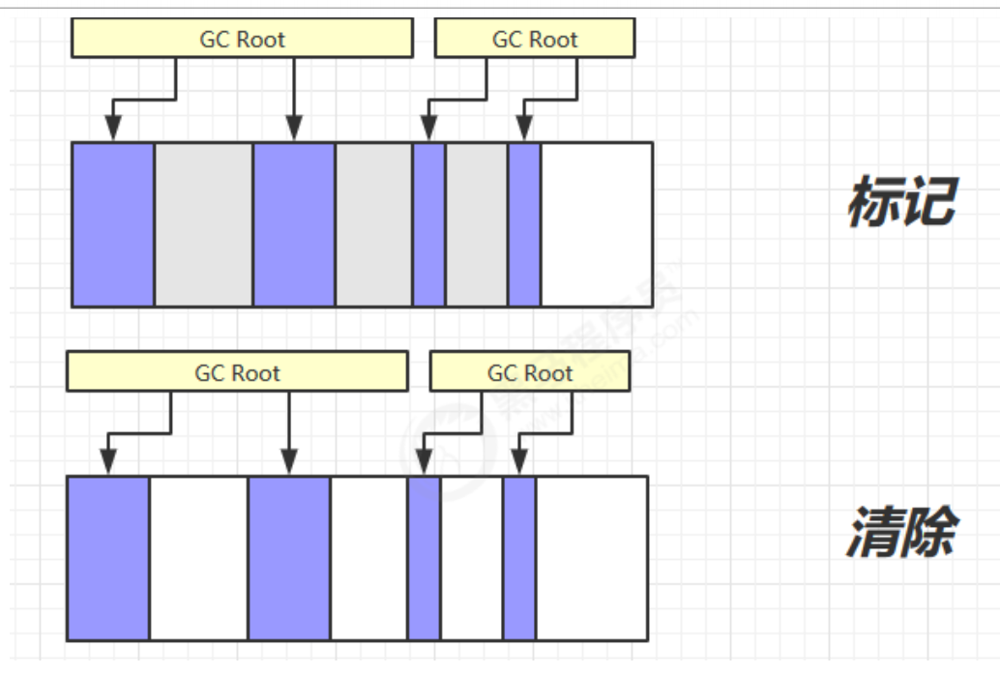

### 2.标记整理

- 不产生内存碎片
- 但是需要移动对象的引用地址，速度较慢

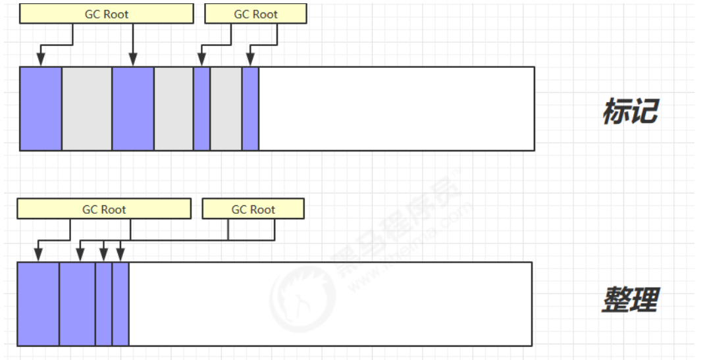

### 3.复制

- 不产生碎片
- 但是占用双倍内存空间

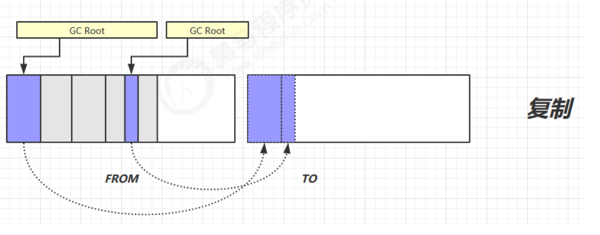

## 分代垃圾回收

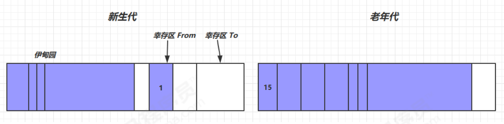

- 对象首先分配在伊甸园区
- 新生代空间不足时，触发minor gc，伊甸园和from存活的对象使用copy复制到to中，存活的对象年龄加1，并且交换from和to
- minor gc会触发stop the world（暂停其他正在运行的线程，待垃圾回收结束，这些线程才恢复运行）
- 当对象寿命超过阈值时（最大15次 4bit）会晋升到老年代
- 当老年代空间不足，先尝试触发minor gc，如果之后空间仍不足，那么触发full gc，也会触发stop the world，时间会更长
- 在放入大对象时，如果新生代空间不足，则直接进入老年代

### 相关VM参数

| 含义               | 参数                                                        |
| ------------------ | ----------------------------------------------------------- |
| 堆初始大小         | -Xms                                                        |
| 堆最大大小         | -Xmx或-XX:MaxHeapSize=size                                  |
| 新生代大小         | -Xmn或(-XX:NewSize=size +-XX:MaxNewSize=size)               |
| 幸存区比例（动态） | -XX:InitialSurvivorRatio=ratio 和-XX:+UseAdaptiveSizePolicy |
| 幸存区比例         | -XX:SurvivorRatio=ratio                                     |
| 晋升阈值           | -XX:MaxTenuringThreshold=threshold                          |
| 晋升详情           | -XX:+PrintTenuringDistribution                              |
| GC 详情            | -XX:+PrintGCDetails -verbose:gc                             |
| FullGC前MinorGC    | -XX:+ScavengeBeforeFullGC                                   |

## 垃圾回收器

### 1.串行

- 单线程

- 堆内存较小，适合个人电脑

- 开启指令：

  ```java
  -XX:+UseSerialGC=Serial+SerialOld
  ```

  Serial：发生在新生代，采用复制算法

  SerialOld：发生在老年代，采用标记整理算法

  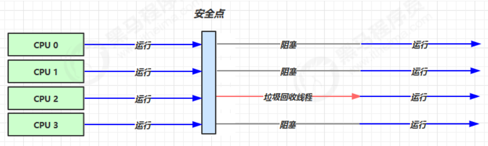

### 2.吞吐量优先

- 多线程

- 堆内存较大，多核cpu

- 让单位时间内，STW的时间最短，比如一个小时内发生只发生两次GC 0.2+0.2=0.4

- 多个垃圾回收线程并行执行，但是不允许用户线程执行

- 开启指令：

  ```java
  -XX:+UseParallelGC ~-XX:+UseParallelOldGC
  -XX:+UseAdaptiveSizePolicy  //使用自适应的方式调整新生代的伊甸园和幸存区的比例
  -XX:GCTimeRatio=ratio   //调整吞吐量的占比 1/(1+ratio)，默认ratio=99，也就是说100分钟内只有1分钟用于GC，一般radio设置为19
  -XX:MaxGCPauseMillis=ms//默认值200ms，垃圾回收暂停时间
  -XX:ParallelGCThreads=n
  ```

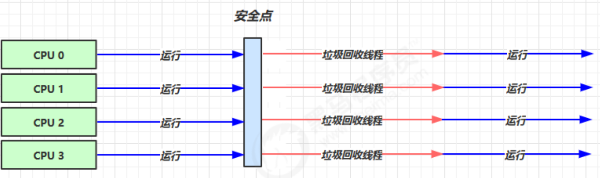

### 3.响应时间优先

- 多线程

- 堆内存较大，多核cpu

- 尽可能让单次STW时间最短，比如一个小时内发生多次GC，但每次GC时间尽可能短 0.1+0.1+0.1+0.1+0.1=0.5

- 用户线程和垃圾回收线程并发的执行

- 开启指令：

  ```java
  -XX:+UseConcMarkSweepGC ~ -XX:+UseParNewGc ~ SerialOld
  -XX:ParallelGCThreads=n ~ -XX:ConcGCThreads=threads
  -XX:CMSInitiatingOccupacyFraction=percent//设置垃圾占比，比如设置为60，则在垃圾达到60%时便触发垃圾回收
  -XX:+CMSScavengeBeforeRemark
  ```

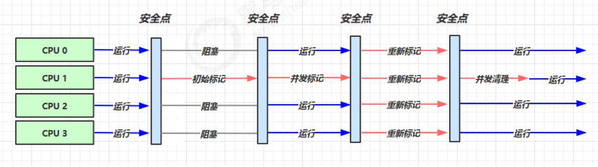

### 4.G1（Garbage First）

- JDK9开始默认

- 同时注重吞吐量和低延迟，默认的暂停目标是200ms

- 超大堆内存，会将堆划分为多个大小相等的Region

- 整体上是标记+整理算法，两个区域之间是复制算法

- 把连续的Java堆划分为多个大小相等的独立区域（Region），每一个Region都可以根据需要，扮演新生代的Eden空间、Survivor空间，或者老年代空间。

- 相关指令：

  ```java
  -XX:+UseG1GC
  -XX:G1HeapRegionSize=size
  -XX:MaxGCPauseMillis=time
  ```

#### Young Collection

- 先启用新生代内存空间，白色方块代表空闲区，会STW

- 当新生代满时触发Minor GC 以拷贝算法复制到幸存区

  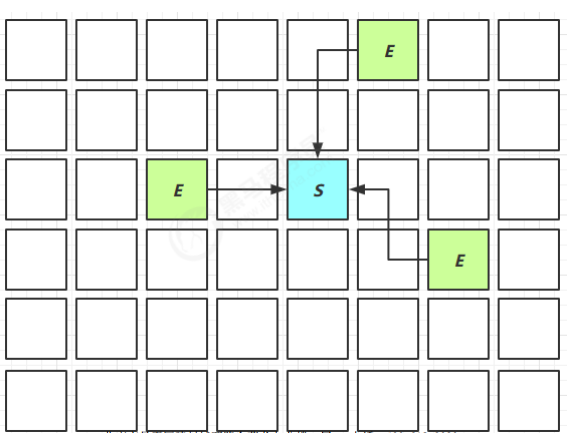

- 当幸存区对象较多或者幸存区的对象年龄超过阈值则幸存区的一部分就会拷贝到老年代

  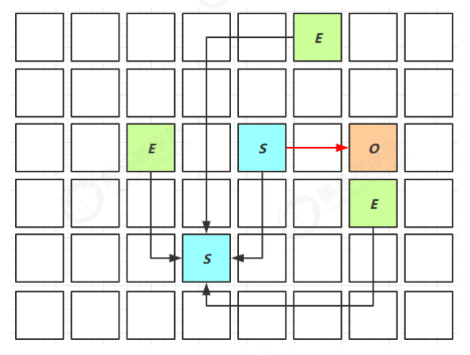

#### Young Collection+CM

- 在Young GC时会进行GC Root的初始标记
- 老年代占用堆空间比例达到阈值时，进行并发标记（不会STW），由JVM参数决定`-XX:InitiatingHeapOccupancyPercent=percent`（默认45%）

#### Mixed Collection

- 会对E、S、O进行全面垃圾回收

- 最终标记会STW

- 拷贝存活会STW

- 根据最大暂停时间又选择的回收，从老年代中挑出部分回收价值高的进行回收

  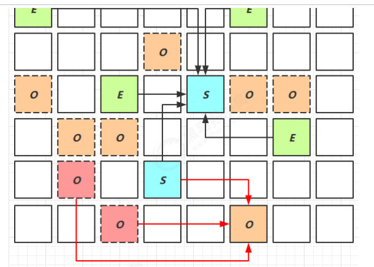

#### Full GC

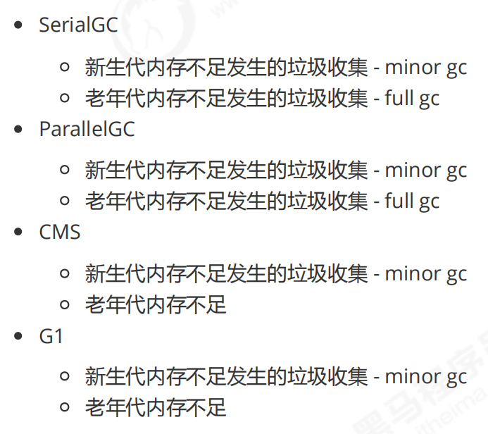

#### YoungCollection 跨代引用

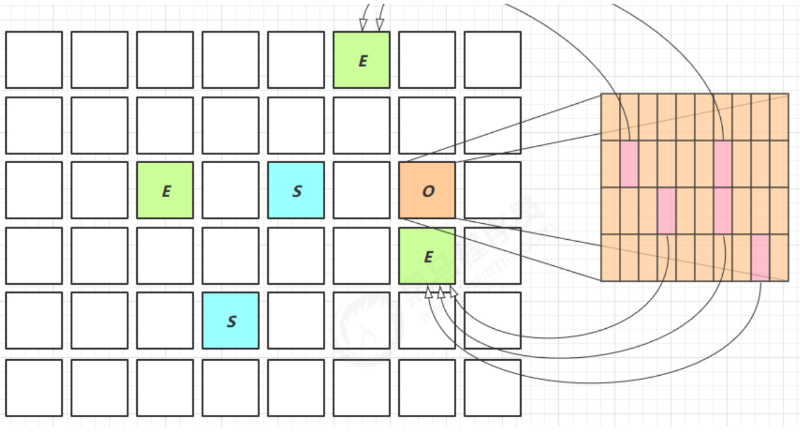

#### Remark

- pre-write barrier + satb_mark_queue

#### JDK 8u20字符串去重

- 优点：节省大量内存

- 缺点：略微多占用了cpu时间，新时代回收时间略微增加

- 指令：默认开启

  ```java
  -XX:+UseStringDeduplication
  String s1 = new String("hello");//char[]{'h','e','l','l','o'}
  String s2 = new String("hello");//char[]{'h','e','l','l','o'}
  ```

- 将所有新分配的字符串放入一个队列

- 当新生代回收时，G1并发检查是否有字符串重复

- 如果他们值一样，让它们引用同一个char[]

- 与String.intern()的区别

  - String.intern()关注的是字符串对象
  - 而字符串去重关注的是char[]
  - 在JVM内部，使用了不同的字符串表

#### JDK 8u40并发标记类卸载

- 当所有对象都经过并发标记后，就能知道哪些类不再被使用，当一个类加载器的所有类都不再使用，则卸载他所加载的所有类

- 指令：默认启用

  ```java
  -XX:+ClassUnloadingWithConcurrentMark
  ```

#### JDK 8u60回收巨型对象

- 一个对象大于region的一半时，称之为巨型对象
- G1不会对巨型对象进行拷贝
- 回收时被优先考虑
- G1会跟踪老年代所有incoming引用，这样老年代incoming引用为0的巨型对象就可以在新生代垃圾回收时处理掉

#### JDK9并发标记起始时间的调整

- 并发标记必须在堆空间占满前完成，否则会退化为FullGC
- JDK9之前需要使用指令启用`-XX:InitiatingHeapOccupancyPercent`
- JDK9可以动态调整
  - `-XX:InitiatingHeapOccupancyPercent`用来设置初始值
  - 进行数据采样并动态调整
  - 总会添加一个安全的空档空间

## 垃圾回收调优

- 查看虚拟机运行参数

  ```java
  "E:\Java\jdk1.8.0_91\bin\java" -XX:+PrintFlagsFinal -version | findstr "GC"
  ```

### 新生代调优

- 所有new操作的内存分配非常廉价

- 死亡对象的回收代价是0

- 大部分对象用过即死

- MinorGC的时间远远低于FullGC

- Oracle官方建议新生代的大小占2到整个堆内存的25%~50%

- 设置新生代空间指令：`-Xmn`

- 新生代能容纳所有【并发量*（请求-响应）】的数据

- 幸存区大到能保留【当前活跃对象+需要晋升对象】

- 晋升阈值配置得当，让长时间存活对象尽快晋升

  ```java
  -XX:MaxTenuringThreshold=threshold
  -XX:+PrintTenuringDistribution
  ```

### 老年代调优

- CMS的老年代内存越大越好

- 先尝试不做调优，如果没有FullGC那么已经放下了，否则先尝试调优新生代

- 观察发生FullGC时老年代内存占用，将老年代内存预设调大1/4~1/3

- 老年代GC阈值指令：

  ```java
  -XX:CMSInitiatingOccupancyFraction=percent
  ```


