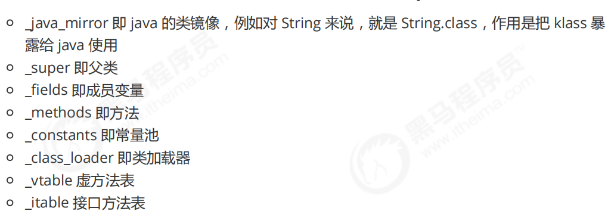

# JVM—类加载

## 类加载阶段

### 1.加载

- 将类的字节码载入方法区中

- 如果这个类还有父类没有加载则先加载父类

- 加载和链接可能是交替运行的

  

### 2.链接

1. 验证

   - 验证类是否符合JVM规范，安全性检查

2. 准备

   为static变量分配空间，设置默认值

   - static变量分配空间和赋值是两个步骤，分配空间在准备阶段完成，赋值在初始化阶段完成
   - 如果static变量是final的基本类型，以及字符串常量，那么编译阶段值就确定了，赋值在准备阶段完成
   - 如果static变量是final的，但不属于引用类型，那么赋值也会在初始化阶段完成

3. 解析

   - 将常量池中的符号引用解析为直接引用

   ```java
   public class Load2 {
       public static void main(String[] args) throws ClassNotFoundException, IOException {
           // loadClass 方法不会导致类的解析和初始化
           ClassLoader classloader = Load2.class.getClassLoader();
           Class<?> c = classloader.loadClass("cn.itcast.jvm.t3.load.C");
   //        new C();
           System.in.read();
       }
   }
   
   class C {
       D d = new D();
   }
   
   class D {
   
   }
   ```

### 3.初始化

<cinit>()v方法，类初始化

- 类初始化是懒惰的

#### 发生的时机

- main方法里的类，总会被首先初始化
- 首次访问这个类的静态变量或静态方法时
- 子类初始化，如果父类还没初始化，会引发
- 子类访问父类的静态变量，只会触发父类的初始化
- Class.forName会触发
- new会导致初始化

#### 不会导致类初始化的情况

- 访问类的static final静态常量（基本类型和字符串）在类加载的链接阶段就完成了，不会触发类初始化
- 类对象.class不会触发初始化，在加载时就会生成new对象，不是在初始化阶段完成的
- 创建该类的数组不会触发初始化
- 类加载器的loadClass方法，只会导致类的加载，解析和初始化都不会进行
- Class.forName方法的第2个参数为false时

## 类加载器

| 名称                    | 加载哪的类            | 说明                                 |
| ----------------------- | --------------------- | ------------------------------------ |
| Bootstrap ClassLoader   | JAVA_HOME/jre/lib     | 无法直接访问                         |
| Extension ClassLoader   | JAVA_HOME/jre/lib/ext | 上级为Bootstrap，getParent显示为null |
| Application ClassLoader | classpath             | 上级为Extension                      |
| 自定义类加载器          | 自定义                | 上级为Application                    |

### 双亲委派模式

- 指调用类加载器的loadClass方法时，查找类的规则
- 委派上级优先做一个类加载器的加载，如果没有才是本级去加载

#### 工作流程

1. 先进入应用类加载器的loadClass方法
2. 查看这个类是否已经被加载了
3. 没有的话获取到应用类加载器的上一级，查看是否为空，不为空就递归调用loadClass方法再查看上一级，值到为空，此时调用findBootstrapClassOrNull方法委派启动类加载器加载
4. 启动类加载器在自己的加载路径下查看是否含有要加载的这个类，有，就加载
5. 没有的话就捕获异常，返回到扩展类加载器
6. 扩展类加载器findClass方法判断自己的加载路径下是否有要加载的这个类，有，就加载
7. 没有的话就捕获异常，返回到应用类加载器
8. 应用类加载器findClass方法判断自己的加载路径下是否有要加载的这个类，有，就加载，否则，返回null

```java
protected Class<?> loadClass(String name, boolean resolve) throws ClassNotFoundException { 
    synchronized (getClassLoadingLock(name)) { 
        // 1. 检查该类是否已经加载 
        Class<?> c = findLoadedClass(name); 
        if (c == null) { 
            long t0 = System.nanoTime();
            try {
                if (parent != null) {
                    // 2. 有上级的话，委派上级 
                    loadClass c = parent.loadClass(name, false); 
                }
                else { 
                    // 3. 如果没有上级了（ExtClassLoader），则委派 
                    BootstrapClassLoaderc = findBootstrapClassOrNull(name);
                }
            } catch (ClassNotFoundException e) { 
            }
            if (c == null) {
                long t1 = System.nanoTime(); 
                // 4. 每一层找不到，调用 findClass 方法（每个类加载器自己扩展）来加载 
                c = findClass(name); 
                // 5. 记录耗时 
                sun.misc.PerfCounter.getParentDelegationTime().addTime(t1 - t0);
                sun.misc.PerfCounter.getFindClassTime().addElapsedTimeFrom(t1); 
                sun.misc.PerfCounter.getFindClasses().increment(); 
            } 
        }
        if (resolve) {
            resolveClass(c);                                                                     }
        return c; 
    } 
}
```

### 线程上下文类加载器

- 线程上下文类加载器是当前线程使用的类加载器，默认就是应用程序类加载器，它内部又是由Class.forName调用了线程上下文类加载器完成类加载

- 获取线程上下文类加载器

```java
Thread.currentThread().getContextClassLoader();
```

### 自定义类加载器

- 还是符合双亲委派原则的

- 使用场景：

  1. 想加载非classpath任意路径下的类文件
  2. 这些类希望予以隔离，不同应用的同名类都可以加载，不冲突，常见于Tomcat容器

- 步骤：

  1. 继承ClassLoader父类
  2. 遵从双亲委派机制，重写findClass方法，不要重写loadClass方法，否则会不走双亲委派机制
  3. 读取类文件的字节码
  4. 调用父类的defineClass方法类加载类
  5. 使用者调用该类加载器的loadClass方法

  ```java
  public class Load7 {
      public static void main(String[] args) throws Exception {
          MyClassLoader classLoader = new MyClassLoader();
          Class<?> c1 = classLoader.loadClass("MapImpl1");
          Class<?> c2 = classLoader.loadClass("MapImpl1");
          System.out.println(c1 == c2);//true
  
          MyClassLoader classLoader2 = new MyClassLoader();
          Class<?> c3 = classLoader2.loadClass("MapImpl1");
          System.out.println(c1 == c3);//false
  
          c1.newInstance();
      }
  }
  
  class MyClassLoader extends ClassLoader {
  
      @Override // name 就是类名称
      protected Class<?> findClass(String name) throws ClassNotFoundException {
          String path = "e:\\myclasspath\\" + name + ".class";
  
          try {
              ByteArrayOutputStream os = new ByteArrayOutputStream();
              Files.copy(Paths.get(path), os);
  
              // 得到字节数组
              byte[] bytes = os.toByteArray();
  
              // byte[] -> *.class
              return defineClass(name, bytes, 0, bytes.length);
  
          } catch (IOException e) {
              e.printStackTrace();
              throw new ClassNotFoundException("类文件未找到", e);
          }
      }
  }
  ```

  