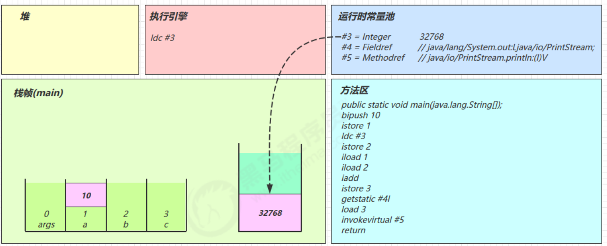
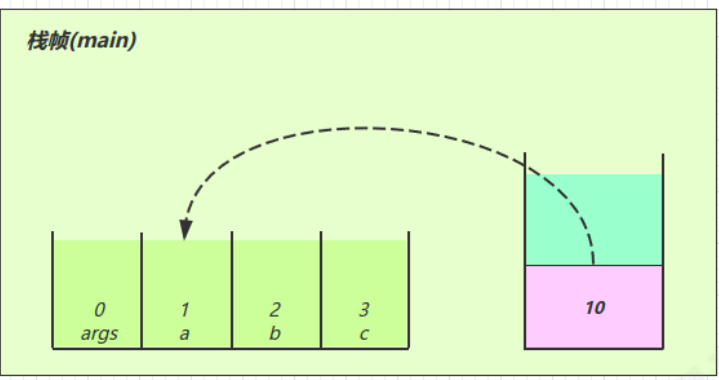
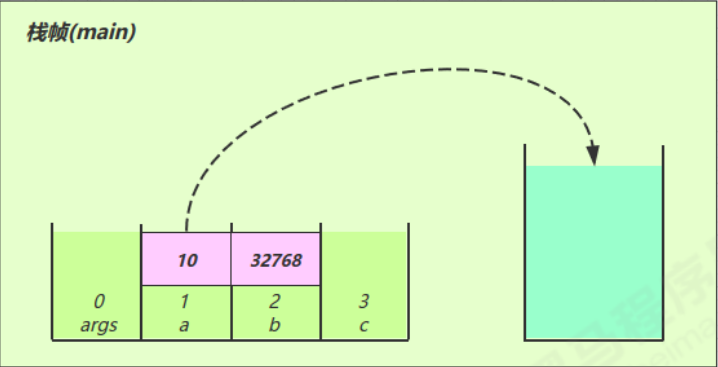
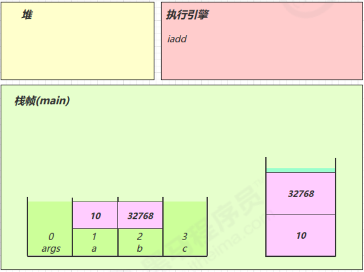
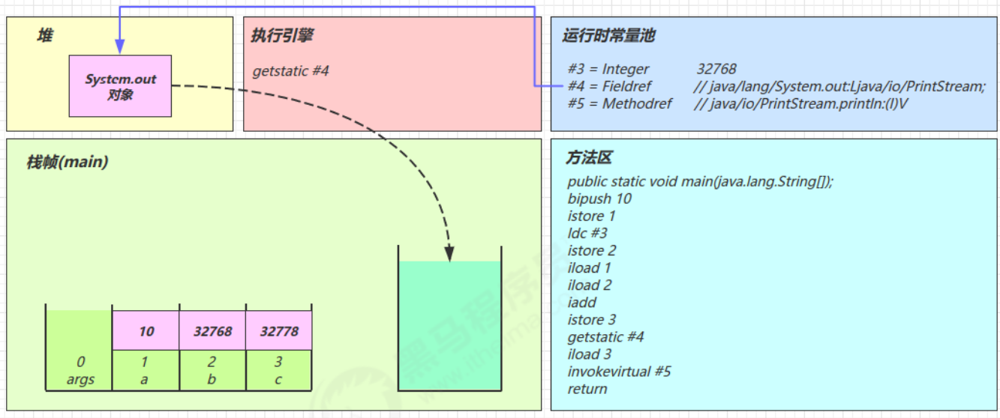
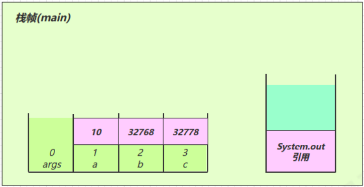
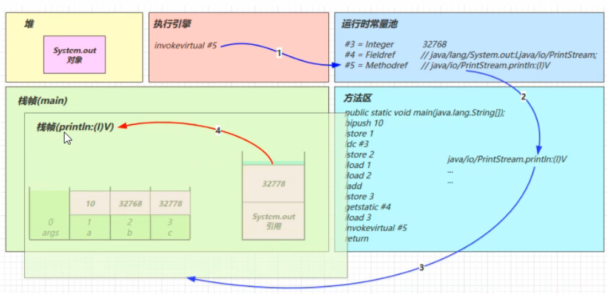
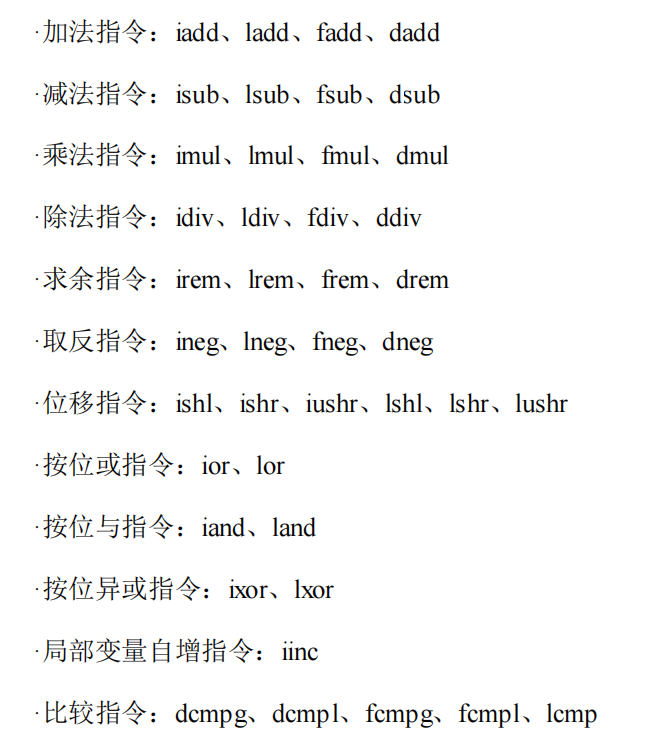
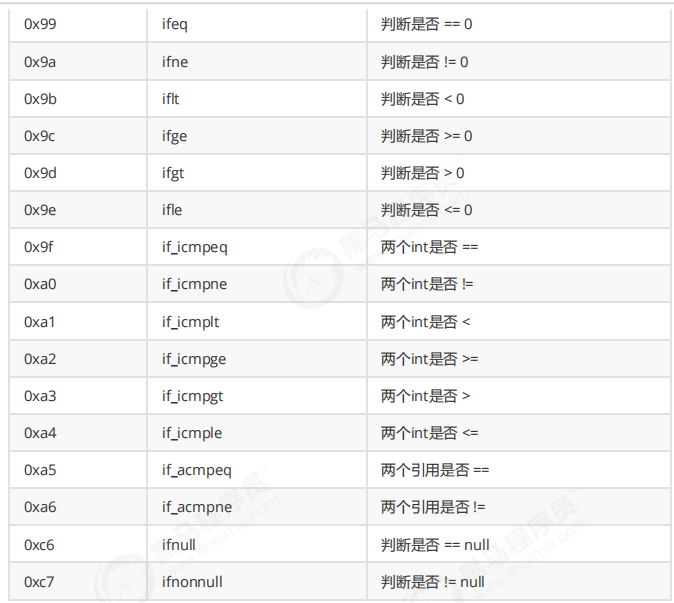

# JVM—类文件结构

## 类文件结构


### 类文件格式

ca fe ba be 00 00 00 34 00 23 0a 00 06 00 15 09

### magic

- 0~3字节，表示它是否是【class】类型文件（ca fe ba beH)

### 版本

- 4~7字节，表示类的版本00 00 00 34H表示的是Java8（十进制为52）

### 常量池

- 8~9字节，表示常量池长度，00 23H（35）表示常量池有#1~#34项，#0项不计入，也没有值

  ca fe ba be 00 00 00 34 <font color='red'>00 23</font> 0a 00 06 00 15 09

## 字节码指令

### javap工具

- 实现反编译.class文件

  ```java
  javap -v HelloWorld.class
  ```

### 流程

1）常量池载入运行时常量池，大于Short的最大值的数值载入（>32767）

2）方法字节码载入方法区

3）main线程开始运行，分配栈帧内存

4）执行引擎开始执行字节码

### 指令

#### bitpush 10

- 将一个byte（数值为10）压入操作数栈（其长度会补齐4个字节）

#### sipush 10

- 将一个short（数值为10）压入操作数栈（其长度会补齐4个字节）

#### ldc #3

- 从常量池加载#3数据到操作数栈，将一个int压入操作数栈，（int值存在常量池中）
- 小的数字都是和字节码指令存在一起，超过short范围的数字存入常量池（>32767）



#### Idc2_w

- 将一个long压入操作数栈（分两次压入，因为long是8个字节）

#### istore_1

- 将操作数栈顶数据弹出，存入到局部变量表的slot1中



#### iload_1

- 将局部变量表slot 1中的值读到操作数栈中



#### iadd

- 执行引擎执行加法运算，弹出操作数栈中的两个变量，将结果存入操作数栈中



#### getstatic #4

- 在常量池中获得对应的对象，在堆中找到该对象，将该对象的引用地址存入操作数栈中





#### invokevirtual #5

- 找到常量池#5项，定位到方法区java/io/PrintStream.println:(I)V方法
- 生成新的栈帧（分配locals、stack等），传递参数，执行新栈帧中的字节码
- 执行完毕弹出栈帧
- 清除main操作数栈内容



#### return

- 完成main方法调用，弹出main栈帧，程序结束

#### iinc 3,1

- 直接在局部变量slot上进行运算，在slot3上自增1

#### iinc 3,-1

- 在slot3上自减1

#### 常用运算指令表



#### 条件判断指令

- byte，short，char 都会按 int 比较，因为操作数栈都是 4 字节



