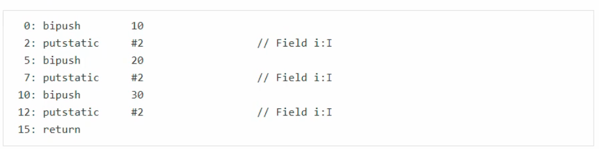
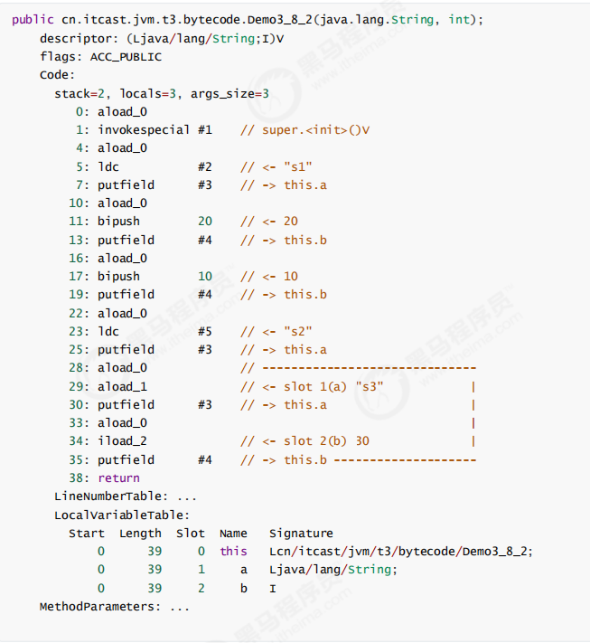
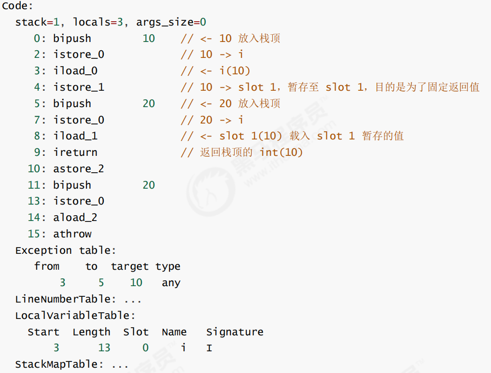

# JVM—类文件结构

## 类文件结构


### 类文件格式

ca fe ba be 00 00 00 34 00 23 0a 00 06 00 15 09

### magic

- 0~3字节，表示它是否是【class】类型文件（ca fe ba beH)

### 版本

- 4~7字节，表示类的版本00 00 00 34H表示的是Java8（十进制为52）

### 常量池

- 8~9字节，表示常量池长度，00 23H（35）表示常量池有#1~#34项，#0项不计入，也没有值

  ca fe ba be 00 00 00 34 <font color='red'>00 23</font> 0a 00 06 00 15 09

## 字节码指令

### javap工具

- 实现反编译.class文件

  ```java
  javap -v HelloWorld.class
  ```

### 流程

1）常量池载入运行时常量池，大于Short的最大值的数值载入（>32767）

2）方法字节码载入方法区

3）main线程开始运行，分配栈帧内存

4）执行引擎开始执行字节码

### 指令

#### bitpush 10

- 将一个byte（数值为10）压入操作数栈（其长度会补齐4个字节）

#### sipush 10

- 将一个short（数值为10）压入操作数栈（其长度会补齐4个字节）

#### ldc #3

- 从常量池加载#3数据到操作数栈，将一个int压入操作数栈，（int值存在常量池中）
- 小的数字都是和字节码指令存在一起，超过short范围的数字存入常量池（>32767）


#### Idc2_w

- 将一个long压入操作数栈（分两次压入，因为long是8个字节）

#### istore_1

- 将操作数栈顶数据弹出，存入到局部变量表的slot1中


#### iload_1

- 将局部变量表slot 1中的值读到操作数栈中


#### iadd

- 执行引擎执行加法运算，弹出操作数栈中的两个变量，将结果存入操作数栈中


#### getstatic #4

- 在常量池中获得对应的对象，在堆中找到该对象，将该对象的引用地址存入操作数栈中


#### invokevirtual #5

- 找到常量池#5项，定位到方法区java/io/PrintStream.println:(I)V方法
- 生成新的栈帧（分配locals、stack等），传递参数，执行新栈帧中的字节码
- 执行完毕弹出栈帧
- 清除main操作数栈内容


#### return

- 完成main方法调用，弹出main栈帧，程序结束

#### iinc 3,1

- 直接在局部变量slot上进行运算，在slot3上自增1

#### iinc 3,-1

- 在slot3上自减1

#### 常用运算指令表


#### 条件判断指令

- byte，short，char 都会按 int 比较，因为操作数栈都是 4 字节


#### 练习

```java
public static void main(String[] args){
    int i=0;
    int x=0;
    while(i<10){
        x=x++;
        i++;
    }
    System.out.println(x);//结果为0
}
```

- 先执行`iload_x`将x=0压入操作数栈中，此时x=0
- 再执行`iinc x,1`  在局部变量表中执行自增操作，此时x=1
- 最后执行`istore_x`将操作数栈中的数据弹出，存入到局部变量表中，此时x=0

### 构造方法解析

#### cinit

```java
public class A{
    static int i = 10;
    static {
        i = 20;
    }
    static {
        i = 30;
    }
}
```

- i最终等于30

- 编译器会按从上到下的顺序，收集所有static静态代码块和静态成员变量赋值的代码，会合并为一个特殊的方法`<cinit>()V`:

  

- `<cinit>()V`方法会在类加载的初始化阶段被调用

#### init

```java
public class Demo3_8_2 {


    private String a = "s1";

    {
        b = 20;
    }

    private int b = 10;

    {
        a = "s2";
    }

    public Demo3_8_2(String a, int b) {
        this.a = a;
        this.b = b;
    }

    public static void main(String[] args) {
        Demo3_8_2 d = new Demo3_8_2("s3", 30);
        System.out.println(d.a);
        System.out.println(d.b);
    }
}
```



### 方法调用

- invokespecial：调用构造方法，私有方法，final方法
- invokestatic：调用静态方法
- invokevirtual：调用普通方法

### 多态的原理

当执行invokevirtual指令时

1. 先通过栈帧中的对象引用找到对象
2. 分析对象头，找到对象的实际Class
3. Class结构中有vtable（虚方法表），它在类加载的链接阶段就已经根据方法的重写规则生成好了
4. 查表得到方法的具体地址
5. 执行方法的字节码

### 异常

#### try...catch

- 多出一个Exception table结构，【from，to）是前闭后开的检测范围，一旦这个范围内的字节码执行出现异常，则通过type匹配异常类型，如果一致，进入target所指示行号
- 8行的字节码指令astore_2是将异常对象引用存入局部变量表的slot2位置

```java
    public static void main(String[] args) {
        int i = 0;
        try {
            i = 10;
        } catch (Exception e) {
            i = 20;
        }
    }
```

```java
Code:
      stack=1, locals=3, args_size=1
         0: iconst_0
         1: istore_1
         2: bipush        10
         4: istore_1
         5: goto          12
         8: astore_2
         9: bipush        20
        11: istore_1
        12: return
      Exception table:
         from    to  target type
             2     5     8   Class java/lang/Exception
      LineNumberTable:
        line 6: 0
        line 8: 2
        line 11: 5
        line 9: 8
        line 10: 9
        line 12: 12
      LocalVariableTable:
        Start  Length  Slot  Name   Signature
            9       3     2     e   Ljava/lang/Exception;
            0      13     0  args   [Ljava/lang/String;
            2      11     1     i   I
```

#### 多个catch

- 因为异常出现时，只能进入Exception table中一个分支，所以局部变量表slot2位置被共用

#### final

- finally中的代码被复制了3份，分别加入try流程，catch流程以及catch剩余的异常类型流程
- 在finally中写了return的话会吞掉25、26行的操作，即抛不出异常

```java
public static void main(String[] args) {
        int i = 0;
        try {
            i = 10;
        } catch (Exception e) {
            i = 20;
        } finally {
            i = 30;
        }
    }
```

```java
    Code:
      stack=1, locals=1, args_size=1
         0: aload_0
         1: invokespecial #1                  // Method java/lang/Object."<init>":()V
         4: return
      LineNumberTable:
        line 3: 0
      LocalVariableTable:
        Start  Length  Slot  Name   Signature
            0       5     0  this   Lcn/itcast/jvm/t3/bytecode/Demo3_11_4;

  public static void main(java.lang.String[]);
    descriptor: ([Ljava/lang/String;)V
    flags: ACC_PUBLIC, ACC_STATIC
    Code:
      stack=1, locals=4, args_size=1
         0: iconst_0
         1: istore_1                  //0--->i
         2: bipush        10          //try
         4: istore_1                  //10-->i
         5: bipush        30          //finally
         7: istore_1                  //30-->i
         8: goto          27          //return
        11: astore_2                  //catch Exception ---> e
        12: bipush        20          //
        14: istore_1                  //20-->i
        15: bipush        30          //finally
        17: istore_1                  //30-->i
        18: goto          27          //return
        21: astore_3                  // catch any -->slot 3
        22: bipush        30          //finally
        24: istore_1                  //30-->i
        25: aload_3                   //把3号局部变量表的异常引用压入操作数栈
        26: athrow                    //throw 抛出异常
        27: return
      Exception table:
         from    to  target type
             2     5    11   Class java/lang/Exception
             2     5    21   any      //剩余的类型异常
            11    15    21   any      //剩余的类型异常
      LineNumberTable:
        line 6: 0
        line 8: 2
        line 12: 5
        line 13: 8
        line 9: 11
        line 10: 12
        line 12: 15
        line 13: 18
        line 12: 21
        line 14: 27
      LocalVariableTable:
        Start  Length  Slot  Name   Signature
           12       3     2     e   Ljava/lang/Exception;
            0      28     0  args   [Ljava/lang/String;
            2      26     1     i   I
```

#### finally练习

```java
public static int test() {//返回值为10
    int i = 10;
    try {
        return i;
    } finally {
        i = 20;
    }
}
```

- 先将10压入栈顶，然后存入局部变量表0中，再将10读出来，再存入局部变量表1中，这一步是为了固定返回值，再将20压入栈顶，然后存入局部变量表0中，再将局部变量表1中的10压入栈中，弹出栈顶的10



### synchronized

- 注意，方法级别的synchronized不会在字节码指令中有所体现

```java
    public static void main(String[] args) {
        Object lock = new Object();
        synchronized (lock) {
            System.out.println("ok");
        }
    }
```

```java
    Code:
      stack=1, locals=1, args_size=1
         0: aload_0
         1: invokespecial #1                  // Method java/lang/Object."<init>":()V
         4: return
      LineNumberTable:
        line 3: 0
      LocalVariableTable:
        Start  Length  Slot  Name   Signature
            0       5     0  this   Lcn/itcast/jvm/t3/bytecode/Demo3_13;

  public static void main(java.lang.String[]);
    descriptor: ([Ljava/lang/String;)V
    flags: ACC_PUBLIC, ACC_STATIC
    Code:
      stack=2, locals=4, args_size=1
         0: new           #2                  // class java/lang/Object创建一个对象引用到栈中
         3: dup                               //再创建一个对象引用到栈中，用于下一步方法调用的消耗
         4: invokespecial #1                  // Method java/lang/Object."<init>":()V
         7: astore_1                          //lock引用赋值给局部变量表1
         8: aload_1                           //将引用加载到操作对象栈中，synchronized开始
         9: dup                               //复制一份对象引用
        10: astore_2                          //将对象引用存入局部变量表2
        11: monitorenter                      //对lock引用所指向的对象进行加锁
        12: getstatic     #3                  // Field java/lang/System.out:Ljava/io/PrintStream;
        15: ldc           #4                  // String ok
        17: invokevirtual #5                  // Method java/io/PrintStream.println:(Ljava/lang/String;)V
        20: aload_2                           //加载lock对象引用
        21: monitorexit                       //解锁lock所指向的对象
        22: goto          30
        25: astore_3                          //any->slot3
        26: aload_2                           //加载lock对象引用
        27: monitorexit                       //解锁lock所指向对象
        28: aload_3
        29: athrow
        30: return
      Exception table:
         from    to  target type
            12    22    25   any
            25    28    25   any
      LineNumberTable:
        line 6: 0
        line 7: 8
        line 8: 12
        line 9: 20
        line 10: 30
      LocalVariableTable:
        Start  Length  Slot  Name   Signature
            0      31     0  args   [Ljava/lang/String;
            8      23     1  lock   Ljava/lang/Object;
```

## 编译期优化

1. #### 添加默认构造器

2. 自动拆装箱

3. 泛型集合取值

   - 在编译时会自动执行泛型擦除动作，泛型信息在编译为字节码后就丢失了，实际类型都当作Object类型来处理
   - 取值时，编译期真正生成的字节码中，还要额外做一个类型转换的操作
   - 擦除的是字节码上的泛型信息，LocalVariableTable仍然保留了方法参数泛型的信息

4. 可变参数

   - String... args其实是一个String[] args
   - 如果调用时没有传参数，即调用该方法的空参方法，那么会创建一个空的数组传进去

5. foreach循环

   ```java
   public class Candy5_1 {
       public static void main(String[] args) { 
           int[] array = {1, 2, 3, 4, 5}; // 数组赋初值的简化写法也是语法糖哦 
           for (int e : array) {
               System.out.println(e); 
           } 
       } 
   }
   ```

   - 编译时代码

   ```java
   public class Candy5_1 { 
       public Candy5_1() { 
       }
       public static void main(String[] args) { 
           int[] array = new int[]{1, 2, 3, 4, 5}; 
           for(int i = 0; i < array.length; ++i) { 
               int e = array[i]; System.out.println(e); 
           } 
       } 
   }
   ```

   - list集合的编译时代码

   ```java
   public class Candy5_2 {
       public Candy5_2() { 
       }
       public static void main(String[] args) { 
           List<Integer> list = Arrays.asList(1, 2, 3, 4, 5); 
           Iterator iter = list.iterator(); 
           while(iter.hasNext()) {
               Integer e = (Integer)iter.next(); System.out.println(e); 
           }
       }
   }
   ```

6. switch字符串

- 为什么第一遍时必须既比较 hashCode，又利用 equals 比较呢？hashCode 是为了提高效率，减少可

  能的比较；而 equals 是为了防止 hashCode 冲突。

```java
public class Candy6_1 { 
    public Candy6_1() { 
    }
    public static void choose(String str) {
        byte x = -1; switch(str.hashCode()) { 
            case 99162322: // hello 的 hashCode 
                if (str.equals("hello")) { 
                    x = 0; 
                }
                break; 
            case 113318802: // world 的 hashCode 
                if (str.equals("world")) {
                    x = 1; 
                }
        }
        switch(x) { 
            case 0:
                System.out.println("h");
                break;
            case 1: 
                System.out.println("w"); 
        } 
    }
}
```

7. try with resource

   ```java
   public class Candy9 {
       public static void main(String[] args) {
           try(InputStream is = new FileInputStream("d:\\1.txt")) {
               System.out.println(is);
           } catch (IOException e) {
               e.printStackTrace();
           }
       }
   }
   ```

   