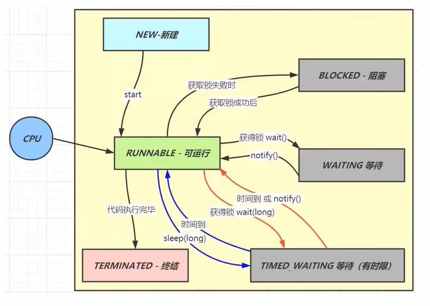

# 并发

## 线程状态



### New-新建

- 用new关键字刚刚创建一个Thread，没有跟操作系统联系起来，仅仅是一个Java对象
- 当调用start方法时进入到可运行状态，cpu才会执行里面的代码

### Runnable-可运行状态

- 只有可运行状态才能被cpu执行
- 当代码执行完毕时进入终结状态

### Terminated-终结

- 说明线程执行完毕，释放线程资源

### Blocked-阻塞

- 可运行状态的线程争抢资源失败（获取锁失败）时进入到阻塞态
- 争抢锁成功后再恢复到可运行态

### Waiting等待

- 当可运行态的线程需要某些执行条件时，可以调用wait方法获取锁，释放资源，进入等待状态
- 当需要的条件满足时，其他线程调用notify方法唤醒该线程，重新去争取锁，争取到会进入可运行态，未争取到就进入阻塞态

### Timed_Waiting 等待（有时限）

- 可运行态线程调用wait(long)时传入一个毫秒值，进入有时限的等待状态
- 当时间到了或者其他线程调用notify方法唤醒该线程，这时就可以重新争取锁，争取到会进入可运行态，未争取到就进入阻塞态
- 可运行态线程调用sleep(long)方法，进入有限等待状态
- 当时间到了直接恢复可运行态

## 线程池

### 线程池的核心参数

- 核心线程：执行完任务以后任然需要保留在CPU中，corePoolSize可以为0
- 救急线程：执行完任务后不需要保留在CPU中，当时间单位线程内没有任务执行时，就会被从线程池中移除
- maximumPoolSize：最大线程数=核心线程+救急线程
- keepAliveTime：生存时间，针对救急线程
- unit：时间单位，针对救急线程
- workQueue：阻塞队列，缓冲任务，当核心线程都在忙时，新来的任务存在任务队列里，当达到上限时，会将新任务放入救急线程中运行
- threadFactory：线程工厂，可以在线程创建时为线程起个名字
- handler拒绝策略：处理核心线程和救急线程都在忙时的情况
  - AbortPolicy：直接抛异常
  - CallerRunsPolicy：调用者自行执行这个任务（可以是主线程）
  - DiscardPolicy：直接丢弃新来的任务，不会报任何异常或者错
  - DiscardOldestPolicy：丢弃任务队列中最先进来的任务，将最新任务加入

```java
public class TestThreadPoolExecutor {
    public static void main(String[] args) {
        AtomicInteger c = new AtomicInteger(1);
        ArrayBlockingQueue<Runnable> queue = new ArrayBlockingQueue<>(2);
        ThreadPoolExecutor threadPool = new ThreadPoolExecutor(
                2,//核心线程数
                3,//最大线程数
                0,//救急线程生存时间
                TimeUnit.MILLISECONDS,//救急线程生存时间单位
                queue,//缓冲队列
                runnable -> new Thread(runnable,"myThread"+c.getAndIncrement()),//线程工厂，为线程创建名字
                new ThreadPoolExecutor.AbortPolicy()//拒绝策略
        );
        threadPool.submit(new MyTask("1",360000));
    }
}
```

## sleep vs wait

### 共同点

- wait(),wait(long),sleep(long)的效果都是让当前线程暂时放弃CPU的使用权

### 不同点

#### 方法归属不同

- sleep(long)是Thread的静态方法
- wait(),wait(long)都是Object的成员方法，每个对象都有

#### 醒来时机不同

- 执行sleep(long)和wait(long)的线程都会在对待相应毫秒后醒来
- wait(long)和wait()还可以被notify唤醒，wait()如果不唤醒就一直等下去
- 他们都可以被打断唤醒

#### 锁特性不同

- wait方法的调用必须先获取wait对象的锁，而sleep则无此限制
- wait方法执行后会释放对象锁，允许其他线程获得对象锁
- sleep如果在synchronized代码块中执行，并不会释放对象锁