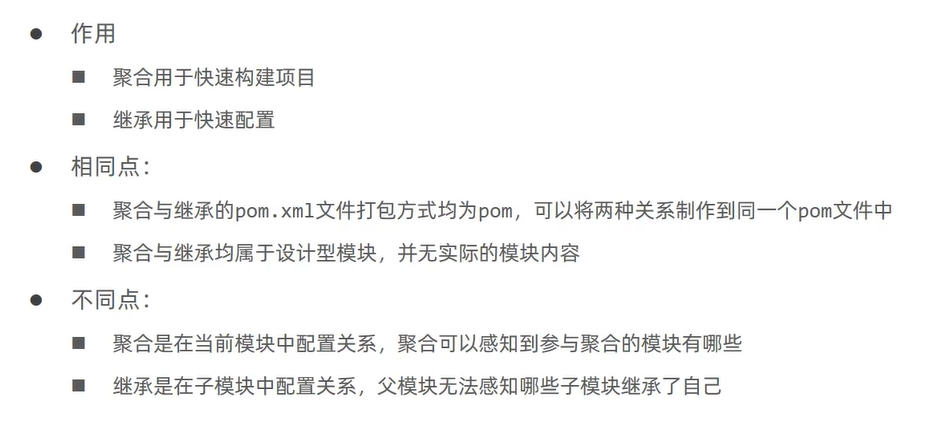
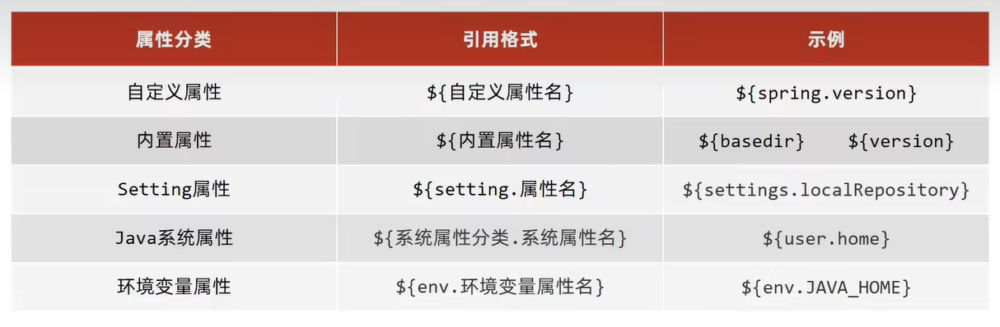
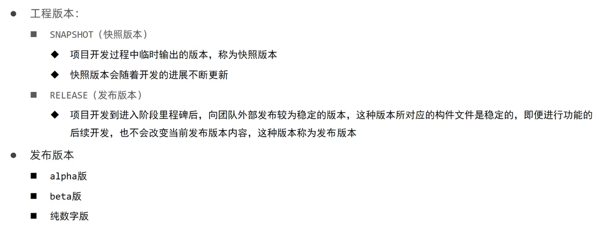
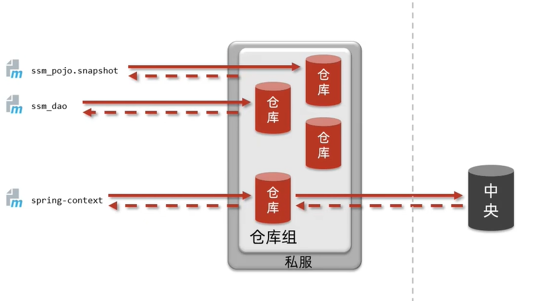
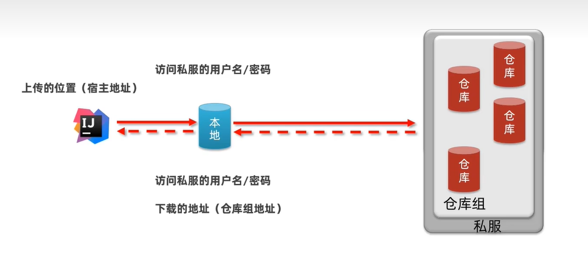

# Maven

## 分模块开发

1. 创建maven模块
2. 书写模块代码
3. 通过maven指令安装模块到本地仓库（install指令）

## 依赖管理

### 依赖传递

- 依赖具有传递性
  - 直接依赖
  - 间接依赖
- 依赖传递冲突问题
  - 路径优先：当依赖中出现相同的资源时，层级越深，优先级越低，层级越浅，优先级越高。直接依赖高于间接依赖
  - 声明优先：当资源在相同层级被依赖时，配置顺序靠前的覆盖配置顺序靠后的
  - 特殊优先：当同级配置了相同资源的不同版本，后配置的覆盖先配置的

### 可选依赖

- 指对外隐藏当前所依赖的资源（不透明）

```xml
<dependency>
    <groupId>com.cq</groupId>
    <artifactId>maven_demo</artifactId>
    <version>1.0-SNAPSHOT</version>
    <!--            可选依赖是隐藏当前工程所依赖的资源，隐藏后对应资源将不具有依赖传递性-->
    <optional>true</optional>
</dependency>
```

### 排除依赖

- 指主动断开依赖的资源，被排除的资源无需指定版本（不需要）

```xml
<dependency>
    <groupId>org.example</groupId>
    <artifactId>maven_04</artifactId>
    <version>1.0-SNAPSHOT</version>
    <exclusions>
        <exclusion>
            <groupId>log4j</groupId>
            <artifactId>log4j</artifactId>
        </exclusion>
    </exclusions>
</dependency>
```

## 继承与聚合

### 聚合

- 将多个模块组织成一个整体，同时进行项目构建的过程

- 创建Maven模块，设置打包类型为pom

  ```xml
      <packaging>pom</packaging>
  ```

- 设置当前聚合工程所包含的子模块名称

  ```xml
  <!--    设置管理的模块名称-->
      <modules>
          <module>../maven_04</module>
          <module>../maven_demo</module>
          <module>../springmvc_ssm/springmvc_ssm</module>
      </modules>
  ```

### 继承

- 子工程可以继承父工程中的配置信息

- 创建Maven模块，设置打包类型为pom

  ```xml
      <packaging>pom</packaging>
  ```

- 在父工程的pom文件中配置依赖关系（子工程将沿用父工程中的依赖关系）

- 在父工程中配置子工程中可选的依赖关系

  ```xml
      <dependencyManagement>
          <dependencies>
              <dependency>
                  <groupId>com.alibaba</groupId>
                  <artifactId>druid</artifactId>
                  <version>1.1.16</version>
              </dependency>
          </dependencies>
      </dependencyManagement>
  ```

- 在子工程中配置当前工程所继承的父工程

  ```xml
    <parent>
      <groupId>com.cq</groupId>
      <artifactId>maven_01</artifactId>
      <version>1.0-SNAPSHOT</version>
  <!--    填写父工程的pom文件-->
      <relativePath>../../maven_01/pom.xml</relativePath>
    </parent>
  ```

- 在子工程中配置使用父工程中可选依赖的坐标，不需要提供版本号

  ```xml
  <dependencies>
  	<dependency>
        <groupId>com.alibaba</groupId>
        <artifactId>druid</artifactId>
      </dependency>
  </dependencies>
  ```

### 聚合与继承的区别



## 属性

```xml
<!--    定义属性-->
    <properties>
        <spring.version>5.2.10.RELEASE</spring.version>
    </properties>
```

使用

```xml
        <dependency>
            <groupId>org.springframework</groupId>
            <artifactId>spring-webmvc</artifactId>
            <version>${spring.version}</version>
        </dependency>
```

### 资源文件引入属性

1. 定义属性

   ```xml
       <properties>
           <spring.version>5.2.10.RELEASE</spring.version>
           <jdbc.url>jdbc:mysql://127.0.0.1:3306/myfriend</jdbc.url>
       </properties>
   ```

2. 配置文件中引入属性

   ```xml
   jdbc.driver=com.mysql.jdbc.Driver
   jdbc.url=${jdbc.url}
   jdbc.username=root
   jdbc.password=root
   ```

3. 开启资源文件目录加载属性的过滤器

   ```xml
       <build>
           <resources>
               <resource>
                   <directory>${project.basedir}/src/main/resources</directory>
                   <filtering>true</filtering>
               </resource>
           </resources>
       </build>
   ```

4. 配置maven打war包时，忽略web.xml检查

   ```xml
   	<build>
           <plugins>
               <plugin>
                   <groupId>org.apache.maven.plugins</groupId>
                   <artifactId>maven-surefire-plugin</artifactId>
                   <configuration>
                       <testFailureIgnore>true</testFailureIgnore>
                   </configuration>
               </plugin>
           </plugins>
       </build>
   ```

### 其他属性



### 版本管理



## 多环境配置与应用

### 多环境开发

- 配置多环境

  ```xml
  <!--    配置多环境-->
      <profiles>
  <!--        开发环境-->
          <profile>
              <id>env_dep</id>
              <properties>
                  <jdbc.url>jdbc:mysql://127.0.0.1:3306/myfriend</jdbc.url>
              </properties>
  <!--            设定是否为默认启动环境-->
              <activation>
                  <activeByDefault>true</activeByDefault>
              </activation>
          </profile>
          <!--        生产环境-->
          <profile>
              <id>env_pro</id>
              <properties>
                  <jdbc.url>jdbc:mysql://127.1.1.1:3306/myfriend</jdbc.url>
              </properties>
          </profile>
          <!--        测试环境-->
          <profile>
              <id>env_test</id>
              <properties>
                  <jdbc.url>jdbc:mysql://127.2.2.1:3306/myfriend</jdbc.url>
              </properties>
          </profile>
      </profiles>
  ```

- 使用多环境（构建过程）

  ```
  mvn 指令 -P 环境定义id
  ```

  例

  ```
  mvn install -P env_test
  ```

### 跳过测试

- 指令

  ```
  mvn 指令 -D skipTest
  ```

  例：

  ```
  mvn install -D skipTest
  ```

- 细粒度控制跳过测试

  ```xml
          <plugins>
              <plugin>
                  <artifactId>maven-surefire-plugin</artifactId>
                  <version>2.12.4</version>
                  <configuration>
  <!--                    设置跳过测试-->
                      <skipTests>true</skipTests>
                      <includes>
                          <include>**/User*Test.java</include>
                      </includes>
  <!--                    排除掉不参与测试的内容-->
                      <excludes>
                          <exclude>**/FriendServiceTest.java</exclude>
                      </excludes>
                  </configuration>
              </plugin>
          </plugins>
  ```

## 私服

- 私服是一台独立的服务器，用于解决团队内部的资源共享与资源同步问题

### Nexus安装与启动

- 启动服务器（命令行启动）

  ```
  nexus.exe /run nexus
  ```

- 访问服务器（默认端口：8081）

  ```
  http://localhost:8081
  ```

- 修改基础配置信息

  安装路径下ect目录中nexus-default.properties文件保存有nexus基础配置信息，例如默认访问端口号

- 修改服务器运行配置信息

  安装路径下bin目录中nexus.vmoptions文件保存有nexus服务器启动对于的配置信息，如默认占用内存空间

### 私服资源操作流程



### 私服仓库分类

| 仓库类别 | 英文名称 | 功能                    | 关联操作 |
| -------- | -------- | ----------------------- | -------- |
| 宿主仓库 | hosted   | 保存自主研发+第三方资源 | 上传     |
| 代理仓库 | proxy    | 代理连接中央仓库        | 下载     |
| 仓库组   | group    | 为仓库编组简化下载操作  | 下载     |

### 资源上传与下载



### 本地仓库访问私服权限设置

- 配置位置（maven的setting.xml文件中）

  ```xml
    <servers>   
  <!-- 配置访问私服的权限-->
      <server>
        <id>cq-release</id>
        <username>admin</username>
        <password>admin</password>
      </server>
      <server>
        <id>cq-snapshot</id>
        <username>admin</username>
        <password>admin</password>
      </server>
    </servers>
  ```

  ```xml
    <mirrors>
      <!-- 私服的访问路径-->
      <mirror>
        <id>maven-public</id>
        <mirrorOf>*</mirrorOf>
        <url>http://localhost:8081/repository/maven-public/</url>
      </mirror>
    </mirrors>
  ```

- 工程pom文件中

  ```xml
  <!--    配置当前工程保存到私服中的具体位置-->
      <distributionManagement>
          <repository>
              <id>cq-release</id>
              <url>http://localhost:8081/repository/cq-release/</url>
          </repository>
          <snapshotRepository>
              <id>cq-snapshot</id>
              <url>http://localhost:8081/repository/cq-snapshot/</url>
          </snapshotRepository>
      </distributionManagement>
  ```

- 发布命令

  ```xml
  mvn deploy
  ```

  

