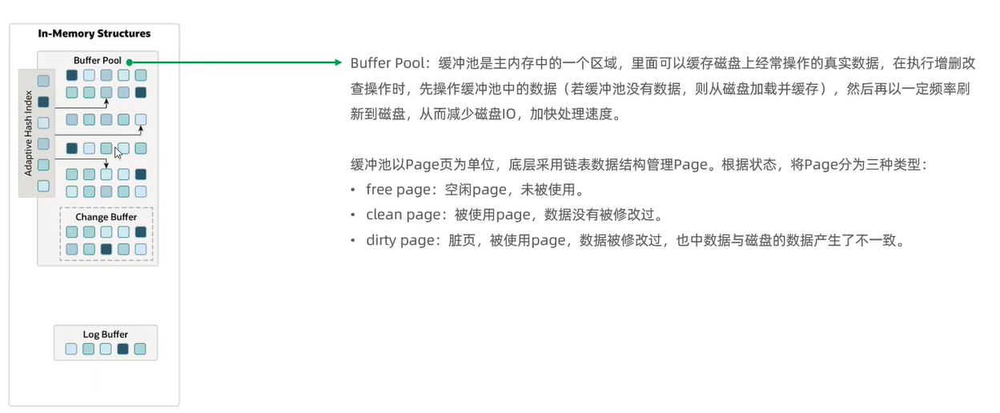
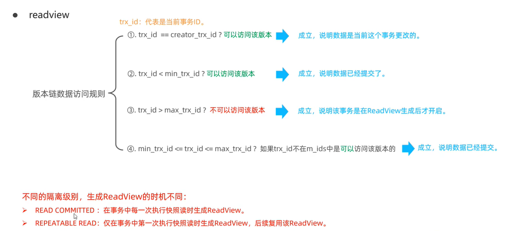

# MySQL进阶—InnoDB存储引擎

## 逻辑存储结构


## 架构

### 内存架构

- Buffer Pool

  

- Change Buffer：针对辅助索引的增删改，当数据被读取时，再将数据合并更新到Buffer Pool中

  

- Log Buffer

  

- Adaptive Hash Index：自适应哈希索引

  

### 磁盘结构

- 系统表空间和每个表的文件表空间（idb文件）

  

- 表空间

  

- 表空间

  

### 后台线程


## 事务原理

原子性、一致性、持久性由redo log和undo log保证，隔离性由锁和MVCC保证。

### redo log

- 记录事务提交时数据页的物理修改，用来实现事务的<font color='red'>持久性</font>。
- 由redo log buffer 和 redo log file 组成，前者在内存后者在磁盘中。
- 当事务提交之后会把所有修改信息都存到日志文件中，用于在刷新脏页到磁盘，发生错误时，进行数据恢复。

### undo log

- 记录数据被修改前的信息，（提供回滚和MVCC）。
- 是逻辑日志，可以认为当delete一条记录时，undo log中会记录一条对应的insert记录，反之，亦然。
- 当执行rollback时，可以从undo log中的逻辑记录读取到相应的内容并进行回滚。保证<font color='red'>原子性</font>。
- Undo log销毁：undo log在事务执行时产生，事务提交时不会立即删除，因为可能还会被用于MVCC。
- Undo log存储：采用段的方式进行管理和记录，存放在rollback segment回滚段中，内部包含1024个undo log segment。

## MVCC多版本并发控制

### 基本概念

- 当前读：

  读取的是记录最新的版本，会对记录加锁，保证其他并发事务不能修改当前记录。

  select...lock in share mode(共享锁)，select...for update、update、insert、delete(排他锁)都是当前读。

- 快照读：

  简单的select（不加锁）就是快照读，<font color='red'>快照读是针对select的</font>，读取的是记录数据的可见版本，有可能是历史数据，不加锁，是非阻塞读。

  - read committed：每次select，都生成一个快照读。
  - repeatable read：开启事务后第一个select语句才是快照读的地方。
  - serializable：快照读会退化为当前读。

- MVCC：

  Multi-Version-Concurrency-Control，指维护一个数据的多个版本，使得读写操作没有冲突，快照读为MySQL提供了一个非阻塞读功能。

### MVCC实现原理

- 记录中的隐式字段

  | 隐藏字段    | 含义                                                         |
  | ----------- | ------------------------------------------------------------ |
  | DB_TRX_ID   | 最近修改事务ID，记录插入这条记录或者最后一次修改这条记录的事务ID |
  | DB_ROLL_PTR | 回滚指针，指向这条记录的上一个版本，用于配合undo log         |
  | DB_ROW_ID   | 隐藏主键，如果表结构没有指定主键，将会生成该隐藏字段         |

  查看表空间文件指令：

  ```mysql
  ibd2sdi 表文件名.ibd
  ```

- undo log

  当insert的时候，产生的undo log只在回滚时需要，在事务提交后，可被立即删除

  当delete、update的时候，产生的undo log日志不仅在回滚时需要，在快照读时也需要，不会立即被删除

- undo log 版本链

  不同事务或相同事务对同一条记录进行修改时，会导致该记录的undo log生成一条版本链，链表头部是最新的旧记录，链表尾部是最早的旧记录

- readview

  读视图，是快照读SQL执行时MVCC提取数据的依据，记录并维护系统当前活跃的事务（未提交的事务）id

  | 字段           | 含义                                           |
  | -------------- | ---------------------------------------------- |
  | m_ids          | 当前活跃的事务id（未提交的事务）               |
  | min_trx_id     | 最小活跃事务的id                               |
  | max_trx_id     | 预分配事务id，为最大事务id+1（事务id是自增的） |
  | creator_trx_id | readview创建者的事务id                         |

  