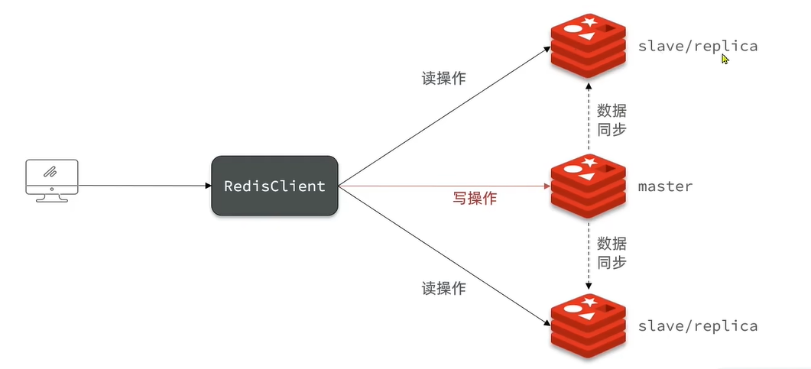
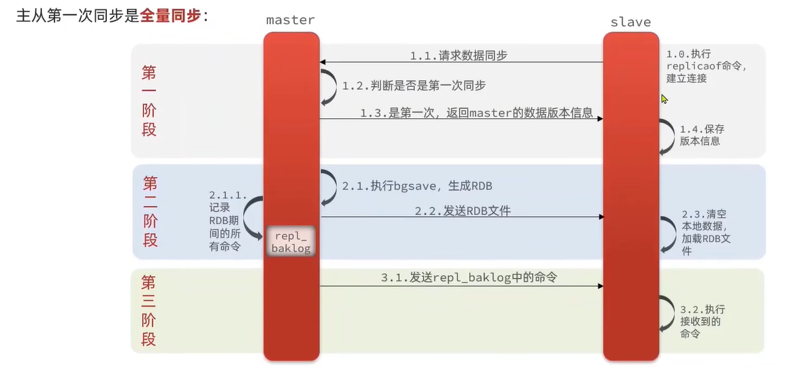
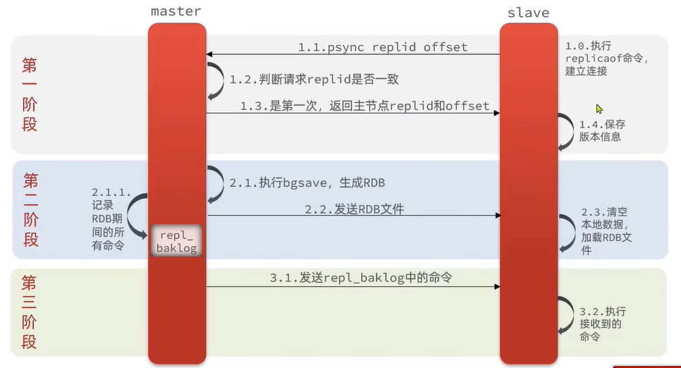
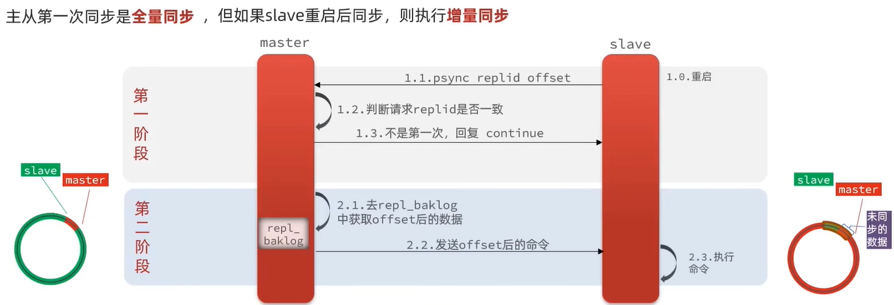
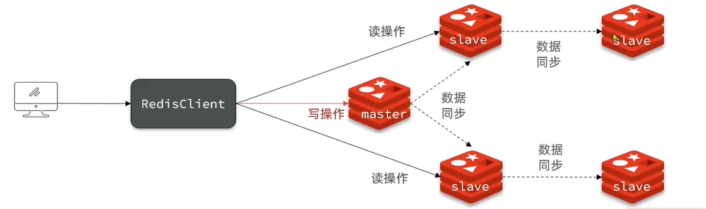

# Redis主从

## 主从架构

## 数据同步原理

### 主从第一次同步

- 全量同步

  

### master怎么判断slave是不是第一次来同步

- Replication Id：简称replid，是数据集的标记，id一致则说明是同一个数据集。每一个master都有唯一的replid，slave则会继承master节点的replid

- offset：偏移量，随着记录在repl_baklog中的数据增多而逐渐增大。slave完成同步时也会记录当前同步的offset。如果slave的offset小于master的offset，说明slave数据落后于master，需要更新

  

## 全量同步流程

- slave发送增量同步请求
- master节点判断replid，发现不一致，拒绝增量同步，发送master的replid和offset
- master将完整内存数据生成RDB，发送RDB到slave
- slave清空本地数据，加载master的RDB
- master将RDB期间的命令记录在repl_baklog，并继续将log中的命令发送给slave
- slave执行接收到的命令，保持与master之间的同步

## 增量同步流程

- repl_baklog大小有上限，主从同步的offset在逻辑上是循环队列，master的offset在前，slave的在后，他俩的距离不能超过repl_baklog的大小，不然就会出现套圈的情况，master会覆盖掉slave还没同步的信息。此时只能再次全量同步。

## 优化

- 在master中配置repl-diskless-sync yes启用无磁盘复制，避免全量同步时的磁盘IO

- Redis单节点上的内存占用不要太大，减少RDB导致的过多磁盘IO

- 适当提高repl_baklog的大小，发现slave宕机时尽快实现故障恢复，尽可能避免全量同步

- 限制一个master上的slave节点数量，如果实在是太多slave，则可采用主-从-从链式结构，减少master压力

  

## 总结

### 增量同步与全量同步的区别

- 全量同步：master将完整内存数据生成RDB，发送RDB到slave。后续命令则记录在repl_baklog，逐个发送给slave
- 增量同步：slave提交自己的offset到master，master获取repl_baklog中从offset之后的命令给slave

### 什么时候执行全量同步

- slave结点第一次连接master结点时
- slave结点断开太久，repl_baklog中的offset已经被覆盖时

### 什么时候执行增量同步

- slave结点断开又恢复，并且在repl_baklog中能找到offset时

