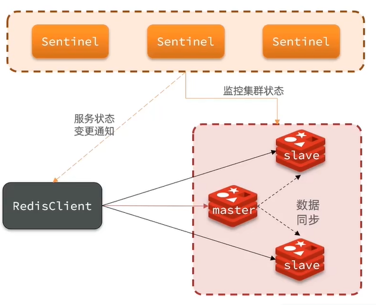
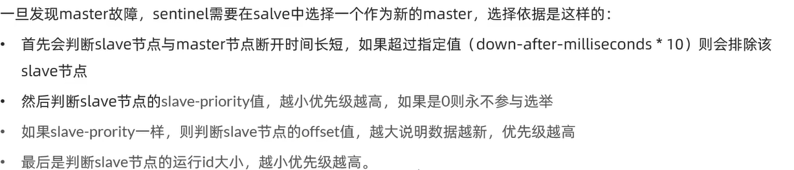
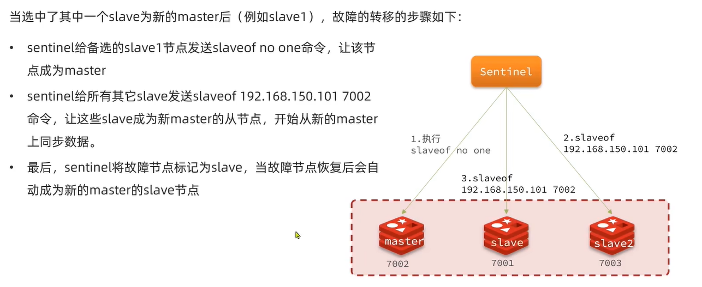

# Redis哨兵

## 哨兵的作用

- 监控：Sentinel会不断检查您的master和slave是否按预期工作
- 自动故障恢复：如果master故障，Sentinel会将一个slave提升为master。当故障实例恢复后也以新的master为主
- 通知：Sentinel充当Redis客户端的服务发现来源，当集群发生故障转移时，会将最新信息推送给Redis客户端

## 服务状态监控

Sentinel基于心跳机制监测服务状态，每隔1秒向集群的每个实例发送ping命令：

- 主观下线：如果某个Sentinel结点发现某实例未在规定时间响应，则认为该实例主观下线
- 客观下线：若超过指定数量（quorum）的Sentinel都认为该实例主观下线，则该实例客观下线。quorum值最好超过Sentinel实例数量的一半。

## 选举新的master

## 如何实现故障转移

