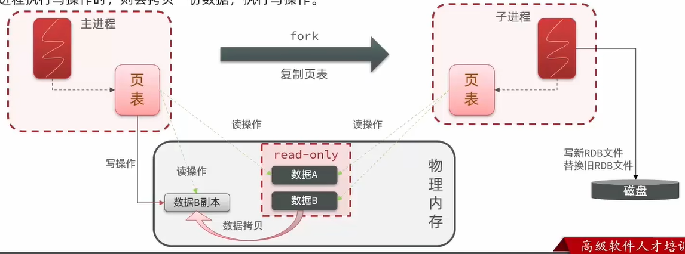
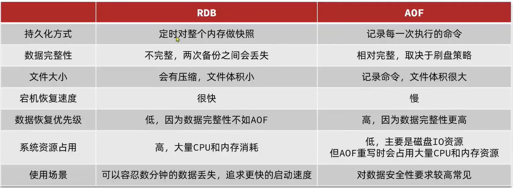

# Redis持久化

## 单点redis问题

- 数据丢失问题：内存存储，服务器重启可能会丢失数据
- 并发能力问题：单点redis并发能力差。
- 故障恢复问题：如果redis宕机，则服务不可用
- 存储能力问题：内存存储的数据量小

## RDB持久化

- RDB文件（redis数据备份文件）：把内存中的所有数据都记录到磁盘中，当redis实例故障重启后，从磁盘读取快照文件，恢复数据。

  ```
  redis-cli
  save #由redis主进程来执行RDB，会阻塞所有命令
  bgsave #开启子进程执行RDB，避免主进程受到影响
  ```

  Redis停机时会执行一次RDB

- Redis内部有触发RDB的机制，可以在redis.conf文件中找到

### bgsave流程

- bgsave开始时会fork主进程得到子进程，子进程共享主进程的内存数据。完成fork后读取内存数据并写入RDB文件

- fork采用的是copy-on-write技术

- 当主进程执行读操作时，访问共享内存

- 当主进程执行写操作时，则会copy一份数据，再执行写操作

- 用新RDB文件替换旧的RDB文件

  

### RDB的缺点

- RDB执行间隔时间长，两次RDB之间写入数据有丢失的风险
- fork子进程、压缩、写出RDB文件都比较耗时

## AOF持久化

- AOF（Append Only File 追加文件）。Redis处理的每一个写命令都会记录在AOF文件，可以看做是命令日志文件

- AOF默认是关闭的，需要修改redis.conf配置文件来开启AOF

  ```
  #开启AOF
  appendonly yes
  #追加策略：每隔一秒追加写一次
  appendfsync everysec
  ```

### bgrewriteaof

- AOF会记录对同一个key的多次写操作，但只有最后一次写操作才有意义，通过`bgrewriteaof`命令，可以让AOF文件执行重写功能，用最少的命令达到相同的效果

- Redis会在触发阈值时自动去重写AOF文件。阈值可以在redis.conf中配置

  ```
  #AOF文件比上次文件增长超过多少百分比则触发重写
  auto-aof-rewrite-percentage 100
  #AOF文件体积最小多大才触发重写
  auto-aof-rewrite-min-size 64mb
  ```

## RDB和AOF对比

