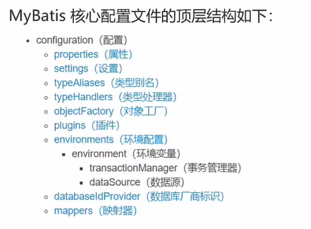

# MyBatis

## 核心配置文件



<font color='red'>配置各个标签时需要遵守前后顺序。</font>

### environments(配置数据库环境)

- 配置数据库连接环境信息，可以配置多个environment，通过default属性切换不同的environment

```xml
	<environments default="development">
        <environment id="development">
            <transactionManager type="JDBC"/>
            <dataSource type="POOLED">
                <property name="driver" value="com.mysql.jdbc.Driver"/>
                <property name="url" value="jdbc:mysql:///myfriend?useSSL=false"/>
                <property name="username" value="root"/>
                <property name="password" value="root"/>
            </dataSource>
        </environment>
    </environments>
```

## mappers(映射代理)

- 配置sql映射映射代理

  ```xml
      <mappers>
  <!--        加载sql映射文件-->
  <!--        <mapper resource="com/cq/mapper/UserMapper.xml"/>-->
  <!--        Mapper代理方式-->
          <package name="com.cq.mapper"/>
      </mappers>
  ```

## typeAliasee(类别名)

- 配置别名

  ```xml
  <!--    给pojo下的文件配置别名，在映射中就可以不写包名了，而且类名还不区分大小写-->
      <typeAliases>
          <package name="com.cq.pojo"/>
      </typeAliases>
  ```


## 查询

### 查询所有

- 数据库表的字段名称和实体类的属性名称不一样，则不能自动封装

```xml
    * 起别名： select company_name as companyName from tb
        * 缺点：每次查询都要定义一次别名
            * sql片段 不灵活
            <sql id="brand_column">
                id,brand_name as brandName, company_name as companyName, ordered
            </sql>
            <select id="select" resultType="brand">
                select 
                    <include refid="brand_column"></include>
                from myfriend;
            </select>
    *  resultMap
        <resultMap id="brandResultMap" type="brand">
            <result column="brand_name" property="brandName"/>
            <result column="company_name" property="companyName"/>
        </resultMap>
        <select id="select" resultMap="brandResultMap">
            select *
            from myfriend;
        </select>
```

### 查看详情

- #{}：会将其替换为？，可以防止sql注入  参数传递时使用

- ${}：拼sql，会存在sql注入问题   表名或者列名不固定的情况下使用

- 参数类型：parameterType：可以省略

- 特殊字符处理：

  - 使用xml专属的转义字符

  - 使用CDATA区

    ```xml
        <select id="selectById" resultType="com.cq.pojo.MyFriend">
            select *
            from myfriend where id <![CDATA[
            <
            ]]> #{id};
        </select>
    ```

```xml
    <select id="selectById" resultType="com.cq.pojo.MyFriend">
        select *
        from myfriend where id = #{id};
    </select>
```

### 条件查询

- 参数接收

  like的占位符需要在调用查询语句时传入参数前手动处理——加上占位符%

  1. 散装参数，如果方法中有多个参数，需要使用@Param（"sql参数占位符名称")
  2. 对象参数，在传参前需要把数据封装成对象
  3. Map参数，在传参前需要把数据封装成map

```xml
<select id="selectByCondition" resultMap="brandResultMap">
	select *
	from tb_brand
	where status = #{status}
		and company_name like #{companyName}
		and brand_name like #{brandName};
</select>
```

```java
List<Brand> selectByCondition(@Param("status") int status,@Param("companyName") String companyName, @Param("brandName") String brandName);
```

```java
List<Brand> selectByCondition(Brand brand);
```

```java
List<Brand> selectByCondition(Map brand);
```

### 动态条件查询

```xml
<select id="selectByCondition" resultMap="brandResultMap">
	select *
	from tb_brand
    <where>
        <if test="status!=null">
       		status = #{status}
        </if>
        <if test="companyName!=null and companyName!=''">
        	and company_name like #{companyName}
        </if>
        <if test="brandName!=null and brandName!=''">
        	and brand_name like #{brandName}
        </if>
    </where>
</select>
```

- 单条件动态查询

  ```xml
  <select id="selectByCondition" resultMap="brandResultMap">
  	select *
  	from tb_brand
      <where>
          <choose><!-- 相对于switch -->
              <when test="status!=null">
                  status = #{status}
              </when>
              <when test="companyName!=null and companyName!=''">
                  and company_name like #{companyName}
              </when>
              <when test="brandName!=null and brandName!=''">
                  and brand_name like #{brandName}
              </when>
              <otherwise><!-- 类似于default 加了where标签以后可以不需要-->
              	1=1
              </otherwise>
          </choose>
      </where>
  </select>
  ```

## 添加

```xml
<insert id="add">
	insert into user(userid,name,password)
    value (#{userid},#{name},#{password});
</insert>
```

- 事务提交，需要显示提交，mybatis关闭了jdbc的事务自动提交

```java
sqlSession.commited();
```

或者在创建sqlSession时设置自动提交

```java
SqlSession sqlSession = sqlSessionFactory.openSession(true);
```

- 返回添加数据的主键

  ```xml
  <insert id="add" useGenerateKeys="true" keyProperty="id">
  	insert into user(userid,name,password)
      value (#{userid},#{name},#{password});
  </insert>
  ```

## 修改

### 修改所有

```xml
<update id="update">
	update tb_brand
    set
    	brand_name = #{brandName},
    	company_name = #{companyName},
    	ordered = #{ordered}，
    	description = #{description},
    	status = #{status}
    where id = #{id};
</update>
```

### 修改动态数据

```xml
<update id="update">
	update tb_brand
    <set>
        <if test="brandName!=null and brandName!=''">
            brand_name = #{brandName},
        </if>
        <if test="companyName!=null and companyName!=''">
    		company_name = #{companyName},
        </if>
        <if test="ordered!=null and ordered!=''">
    		ordered = #{ordered}，
        </if>
        <if test="description!=null and description!=''">
    		description = #{description},
        </if>
        <if test="status!=null and status!=''">
    		status = #{status}
        </if>
    </set>
    where id = #{id};
</update>
```

## 删除

### 删除一个

```xml
<delete id="deleteById">
    delete from myfriends where id=#{id};
</delete>
```

### 批量删除

```java
void deleteByIds(@Param("ids") int[] ids);
```

```xml
<delete id="deleteByIds">
    delete from myfriends where id in (?,?,?)
</delete>
```

- mybatis会将数组参数封装为一个map集合

  默认是：array：

  使用@Param注解改变map集合的默认key的名称

```xml
<delete id="deleteByIds">
    delete from myfriends 
    where id in
    <foreach collection="ids" item="id" separator="," open="(" close=")">
    	#{id}
    </foreach>
    ;
</delete>
```

## 参数传递

- MyBatis提供了ParamNameResolver类来进行参数封装

### 多个参数

- 多个参数封装为Map集合，可以使用@Param注解，替换Map集合中默认的arg键名

  - map.put("arg0",参数值1)

    map.put("arg1",参数值2)

    map.put("param1",参数值1)

    map.put("param2",参数值2)

### 单个参数

1. POJO类型：直接使用，属性名 和 参数占位符名称一致

2. Map集合：直接使用，键名 和 参数占位符一致

3. Collection：封装为Map集合，可以使用@Param注解替换Map集合中的arg键名

   map.put("arg0",collection集合)；

   map.put("collection",collection集合);

4. List：封装为Map集合，可以使用@Param注解替换Map集合中的arg键名

   map.put("arg0",list集合)；

   map.put("collection",list集合);

   map.put("list",list集合);

5. Array：封装为Map集合，可以使用@Param注解替换Map集合中的arg键名

   map.put("arg0",数组);

   map.put("array",数组);

6. 其他类型：直接使用

## 注解开发

```java
@select("select * from myfriend where id = #{id}");
public MyFriend selectById(int id);
```

