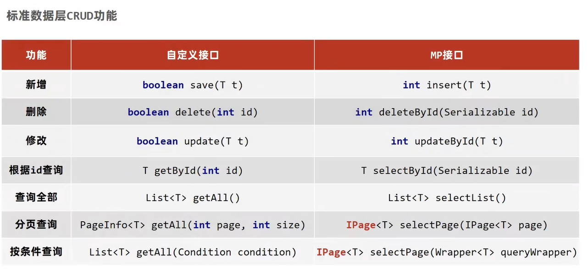
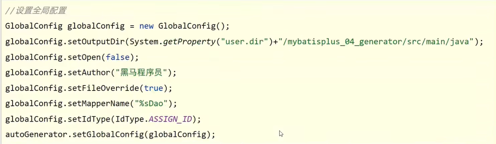
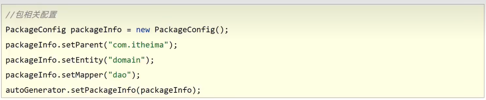
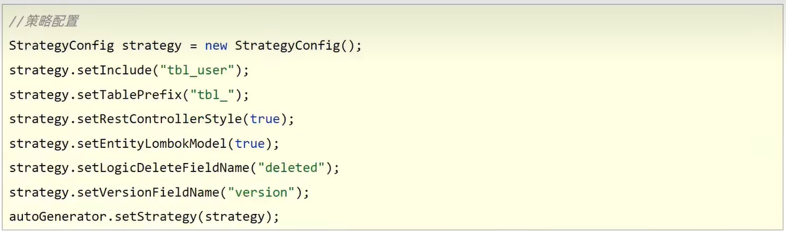

# MybatisPlus

## 创建过程

1. 手动添加起步依赖

   ```xml
   		<dependency>
   			<groupId>com.baomidou</groupId>
   			<artifactId>mybatis-plus-boot-starter</artifactId>
   			<version>3.4.1</version>
   		</dependency>
   ```

2. 设置jdbc参数（application.yml)

   ```yaml
   spring:
     datasource:
       type: com.alibaba.druid.pool.DruidDataSource
       driver-class-name: com.mysql.cj.jdbc.Driver
       url: jdbc:mysql://localhost:3306/myfriend
       username: root
       password: root
   ```

3. 制作实体类与表结构

   ```java
   @TableName(value = "myfriend")
   public class Friend {
       private Integer id;
       private String sex;
       private String name;
       private String telephone;
       private String qq;
       private String email;
       private String address;
       private Integer userid;
       private Integer age;
   }
   ```

4. 定义数据接口，继承BaseMapper\<Friend>

   ```java
   @Mapper
   public interface FriendDao extends BaseMapper<Friend> {
   
   }
   ```

5. 测试类注入dao接口，测试功能

   ```java
   @SpringBootTest
   class MybatisplusDemoApplicationTests {
   
   	@Autowired
   	private FriendDao friendDao;
   	@Test
   	void testGetAll() {
   		List<Friend> friends = friendDao.selectList(null);
   		System.out.println(friends);
   	}
   }
   ```

## 标准数据层开发



- Lombok，java类库，提供了一组注解，简化POJO实体类开发

  ```xml
  		<dependency>
  			<groupId>org.projectlombok</groupId>
  			<artifactId>lombok</artifactId>
              <version>1.18.12</version>
              <scope>provided</scope>
  		</dependency>
  ```

- 常用注解：@Data

  为当前实体类在编译期设置对应的get/set方法，toSting方法，hashCode方法，equals方法等

  ```java
  @TableName(value = "myfriend")
  @Data
  public class Friend {
      private Integer id;
      private String sex;
      private String name;
      private String telephone;
      private String qq;
      private String email;
      private String address;
      private Integer userid;
      private Integer age;
  }
  ```

## 分页功能

1. 设置分页拦截器作为SpringBoot管理的bean

   ```java
   @Configuration
   public class MpConfig {
       @Bean
       public MybatisPlusInterceptor mybatisPlusInterceptor(){
           //1.定义Mp拦截器
           MybatisPlusInterceptor mpInterceptor = new MybatisPlusInterceptor();
           //2.添加具体的拦截器
           mpInterceptor.addInnerInterceptor(new PaginationInnerInterceptor());
           return mpInterceptor;
       }
   }
   ```

2. 执行分页查询

   ```java
   	@Test
   	void testGetByPage(){
   		IPage iPage = new Page(2,10);
   		friendDao.selectPage(iPage,null);
   		System.out.println("当前页码值："+iPage.getCurrent());
   		System.out.println("每页显示数："+iPage.getSize());
   		System.out.println("一共多少页："+iPage.getPages());
   		System.out.println("一共多少数据："+iPage.getTotal());
   		System.out.println("数据："+iPage.getRecords());
   	}
   ```

3. 开启日志

   ```yaml
   # 开启mp的日志（输出到控制台）
   mybatis-plus:
     configuration:
       log-impl: org.apache.ibatis.logging.stdout.StdOutImpl
   ```

## DQL编程控制

### 条件查询

#### 设置查询条件

- 常规格式

  ```java
  		QueryWrapper qw = new QueryWrapper();
  		//查询小于21的数据
  		qw.lt("age",21);
  		//查询大于40的数据
  		qw.gt("age",40);
  		List<Friend> friends = friendDao.selectList(qw);
  		System.out.println(friends);
  ```

- 链式编程格式

  ```java
  		QueryWrapper qw = new QueryWrapper();
  		//查询小于30,大于等于20的数据
  		qw.lt("age",30).ge("age",20);
  		List<Friend> friends = friendDao.selectList(qw);
  		System.out.println(friends);
  ```

- lambda

  ```java
  		QueryWrapper<Friend> qw = new QueryWrapper<>();
  		qw.lambda().lt(Friend::getAge,21);
  		List<Friend> friends = friendDao.selectList(qw);
  		System.out.println(friends);
  ```

- lambda

  ```java
  		LambdaQueryWrapper<Friend> lqw = new LambdaQueryWrapper<>();
  		//21到23之间
  //		lqw.lt(Friend::getAge,23).gt(Friend::getAge,21);
  
  		//小于21或者大于23
  		lqw.lt(Friend::getAge,21).or().gt(Friend::getAge,30);
  
  		List<Friend> friends = friendDao.selectList(lqw);
  		System.out.println(friends);
  ```

#### null值处理

```java
		FriendQuery fq = new FriendQuery();
		fq.setAge2(30);
		fq.setAge(20);
		//null判定
		LambdaQueryWrapper<Friend> lqw = new LambdaQueryWrapper<>();
		//先判定第一个参数是否为true，如果为true连接当前条件
		lqw.lt(null!=fq.getAge2(),Friend::getAge,fq.getAge2())
			.gt(null!=fq.getAge(),Friend::getAge,fq.getAge());
		List<Friend> friends = friendDao.selectList(lqw);
		System.out.println(friends);
```

### 查询投影

- 查询结果包含模型类中部分属性

  ```java
  		LambdaQueryWrapper<Friend> lqw = new LambdaQueryWrapper<>();
  		lqw.select(Friend::getId,Friend::getAge,Friend::getName);
  		List<Friend> friends = friendDao.selectList(lqw);
  		System.out.println(friends);
  ```

- 查询结果包含模型类中未定义的属性

  ```java
  		QueryWrapper<Friend> qw = new QueryWrapper<>();
  		qw.select("count(*) as count,userid");
  		qw.groupBy("userid");
  		List<Map<String, Object>> maps = friendDao.selectMaps(qw);
  		System.out.println(maps);
  ```

### 查询条件

https://mybatis.plus/guide/wrapper.html#abstractwrapper

### 字段映射与表名映射

#### @TableField

- 设置当前属性对应的数据库表中的字段关系

  ```java
  public class User{
      @TableField(value="pwd")
      private String password;
  }
  ```

- 编码中添加了数据库中未定义的属性

  ```java
  public class User{
      @TableField(value="pwd")
      private String password;
      
      @TableField(exist=false)
      private Integer Online;
  }
  ```

- 设置属性是否参与查询

  ```java
  public class User{
      @TableField(value="pwd",select=false)
      private String password;
      
      @TableField(exist=false)
      private Integer Online;
  }
  ```

- 表名与编码开发设计不同步

  ```java
  @TableName("tb_user")
  public class User{
      @TableField(value="pwd",select=false)
      private String password;
      
      @TableField(exist=false)
      private Integer Online;
  }
  ```

## DML编程控制

### id生成策略控制

- AUTO（0）：使用数据库id自增策略控制id生成
- NONE（1）：不设置id生成策略
- INPUT（2）：拥护手工输入id
- ASSIGN_ID（3）：雪花算法生成id（可兼容数值型与字符串型）
- ASSIGN_UUID（4）：以UUID生成算法作为id生成策略

### 全局配置

```yaml
# 开启mp的日志（输出到控制台）
mybatis-plus:
  configuration:
    log-impl: org.apache.ibatis.logging.stdout.StdOutImpl
  global-config:
    banner: false
    db-config:
      id-type: assign_id
      table-prefix: tbl_ #表名前缀
```

### 多记录操作

```java
	@Test
	void testDelete(){
		ArrayList<Integer> list = new ArrayList<>();
		list.add(5);
		list.add(10);
		list.add(7);
		list.add(9);
		friendDao.deleteBatchIds(list);
		List<Friend> friends = friendDao.selectBatchIds(list);
		System.out.println(friends);
	}
```

### 逻辑删除

- 为数据设置是否可用状态字段，删除时设置状态字段为不可用状态，数据保留在数据库中

- 操作

  1. 数据库表中添加逻辑删除标记字段

  2. 实体类中添加对应字段，并设定当前字段为逻辑删除标记字段

     ```java
     public class Friend {
         @TableId(type = IdType.AUTO)
         private Integer id;
         private String sex;
         private String name;
         private String telephone;
         private String qq;
         private String email;
         private String address;
         private Integer userid;
         private Integer age;
     
         //逻辑删除字段，标记当前记录是否被删除
         //@TableLogic(value = "0",delval = "1")
         private Integer deleted;
     
     }
     ```

  3. 配置逻辑删除字段值

     ```yaml
     # 开启mp的日志（输出到控制台）
     mybatis-plus:
       configuration:
         log-impl: org.apache.ibatis.logging.stdout.StdOutImpl
       global-config:
         banner: false
         db-config:
           id-type: assign_id
           table-prefix: tbl_ #表名前缀
     
           #逻辑删除配置
           logic-delete-field: deleted
           logic-delete-value: 1
           logic-not-delete-value: 0
     ```

  ### 乐观锁

  1. 数据库表中添加锁标记字段version

  2. 实体类中添加对应字段，并设定当前字段为逻辑删除标记字段

     ```java
     @TableName(value = "myfriend")
     @Data
     public class Friend {
         @TableId(type = IdType.AUTO)
         private Integer id;
         private String sex;
         private String name;
         private String telephone;
         private String qq;
         private String email;
         private String address;
         private Integer userid;
         private Integer age;
     
         //逻辑删除字段，标记当前记录是否被删除
     //    @TableLogic(value = "0",delval = "1")
         private Integer deleted;
     
         @Version
         private Integer version;
     
     }
     ```

  3. 配置乐观锁拦截器实现锁机制对应的动态SQL语句拼装

     ```java
     @Configuration
     public class MpConfig {
         @Bean
         public MybatisPlusInterceptor mybatisPlusInterceptor(){
             //1.定义Mp拦截器
             MybatisPlusInterceptor mpInterceptor = new MybatisPlusInterceptor();
             //2.添加分页的拦截器
             mpInterceptor.addInnerInterceptor(new PaginationInnerInterceptor());
             //3.添加乐观锁的拦截器
             mpInterceptor.addInnerInterceptor(new OptimisticLockerInnerInterceptor());
             return mpInterceptor;
         }
     }
     ```

## 代码生成器

```yaml
<!--		代码生成器-->
		<dependency>
			<groupId>com.baomidou</groupId>
			<artifactId>mybatis-plus-generator</artifactId>
			<version>3.4.1</version>
		</dependency>
<!--		velocity模板引擎-->
		<dependency>
			<groupId>org.apache.velocity</groupId>
			<artifactId>velocity-engine-core</artifactId>
			<version>2.3</version>
		</dependency>
```

- 创建生成器对象，配置数据源

  ```java
  		AutoGenerator autoGenerator = new AutoGenerator();
          DataSourceConfig dataSource = new DataSourceConfig();
          dataSource.setDriverName("com.mysql.cj.jdbc.Driver");
          dataSource.setUrl("jdbc:mysql://localhost:3306/myfriend?serverTimezone=UTC");
          dataSource.setUsername("root");
          dataSource.setPassword("root");
          autoGenerator.setDataSource(dataSource);
          autoGenerator.execute();
  ```

- 全局配置

  

- 包相关配置

  

- 策略相关配置

  