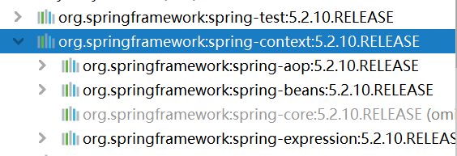

# Spring—AOP

## AOP简介

面向切面编程，在不惊动原始设计的基础上为其进行功能增强

- 连接点：原始方法

- 切入点：需要追加功能的方法叫切入点

- 通知：大部分方法都要实现的功能，共性功能
- 通知类：包含了通知方法（共性方法）的类
- 切面：在哪个切入点上执行哪些通知

## 入门案例

### 导入aop相关坐标

```xml
		<dependency>
            <groupId>org.aspectj</groupId>
            <artifactId>aspectjweaver</artifactId>
            <version>1.9.4</version>
        </dependency>
```

使用spring-context坐标依赖spring-aop坐标



### 定义通知类

```java
@Component
@Aspect
public class MyAdvice {
    @Pointcut("execution(void com.cq.dao.BookDao.update())")//2.定义切入点
    private void pt(){}

    @Before("pt()")//3.连接切入点和通知形成切面
    public void method(){//1.定义通知
        System.out.println(System.currentTimeMillis());
    }
}
```

- 切入点定义依托一个不具有实际意义的方法进行，即无参数，无返回值，方法体无实际逻辑

### 开启spring对AOP注解驱动支持

```java
@Configuration
@ComponentScan({"com.cq.config","com.cq.dao","com.cq.service","com.cq.AOP"})
@EnableAspectJAutoProxy
public class SpringConfig {

}
```

## AOP工作流程

1. Spring容器启动
2. 读取所有切面配置中的切入点
3. 初始化bean，判定bean对应的类中的方法是否匹配到任意切入点
   - 匹配失败，创建对象
   - 匹配成功，创建原始对象（目标对象）的代理对象
4. 获取bean执行方法
   - 获取bean，调用方法并执行，完成操作
   - 获取的bean是代理对象时，根据代理对象的运行模式运行原始方法与增强的内容，完成操作

## 切入点表达式

动作关键字（访问修饰符 返回值 包名.类/接口名.方法名（参数）异常名）

```java
execution(public User com.cq.service.UserService.findById(int))
```

其中访问修饰符和异常名可以省略

### 通配符

- *：单个独立的任意符号，可以独立出现，也可以作为前缀或者后缀的匹配符出现

  ```java
  execution(public * com.cq.*.UserService.find*(*))
  ```

  匹配com.cq包下的任意包中的UserService类或接口中所有find开头的带有一个参数的方法

- .. ：多个连续的任意符号，可以独立出现，常用于简化包名与参数的书写

  ```java
  execution(public User com..UserService.findById(..))
  ```

  匹配com包下的任意包中的UserService类或接口中所有名称为findById的方法

- +：专用于匹配子类类型

  ```java
  execution(* *..*Service+.*(..))
  ```

  匹配任意包下的以Service结尾的子类的任意方法，即任意业务层接口

### 书写技巧

- 描述切入点<font color='red'>通常描述接口</font>，而不描述实现类
- 访问控制修饰符针对接口开发均使用public描述
- 返回值类型对于增删改类使用精准类型加速匹配，对于查询使用*通配符快速描述
- 包名书写尽量不使用..匹配，效率过低，常用*做单个包描述匹配，或精准匹配
- 接口名/类名书写名称与模块相关的采用\*匹配，若UserService书写成\*Service，绑定业务层接口
- 方法名书写以动词进行精准匹配，名次采用*匹配，比如getById书写成getBy\*
- 通常不使用异常作为匹配规则

## 通知类型

### 前置通知

```java
@Before("pt()")
    public void method(){
        System.out.println(System.currentTimeMillis());
    }
```

### 后置通知

```java
@After("pt()")
    public void method(){
        System.out.println(System.currentTimeMillis());
    }
```

### 环绕通知

- 必须依赖`ProceedingJoinPoint`形参才能实现对原始方法的调用
- 如果未使用`ProceedingJoinPoint`对原始方法的调用，将跳过原始方法的执行
- 对原始方法的调用可以不接收返回值，如果接收返回值，通知方法必须将返回值设定为Object类型
- 原始方法的返回值如果是void类型，通知方法可以设置为void也可以设置为Object
- 环绕通知方法必须抛出Throwable对象

```java
    @Around("pt()")
    public Object around(ProceedingJoinPoint pjo) throws Throwable {
        System.out.println("before");
        //表示对原始操作的执行
        Object ob = pjo.proceed();
        System.out.println("after");
        return ob;
    }
```

### AfterReturning

- 方法正常运行完时才运行，不抛出异常才运行

```java
@AfterRetrning("pt()")
    public void method(){
        System.out.println(System.currentTimeMillis());
    }
```

### AfterThrowing

- 方法出异常时才运行

```java
@AfterThrowing("pt()")
    public void method(){
        System.out.println(System.currentTimeMillis());
    }
```

