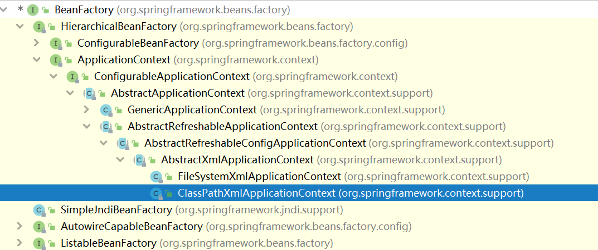
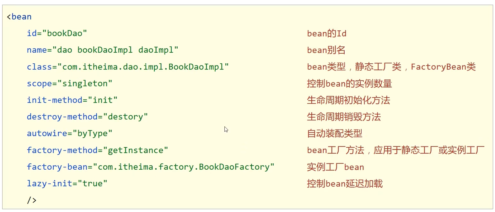
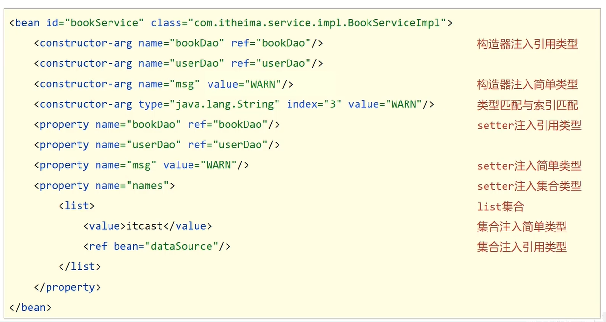

# Spring—IoC、DI、Bean、容器

## IoC控制反转

- 使用对象时，由主动new产生对象转换为由外部<font color='red'>（IoC容器）</font>提供对象，<font color='red'>对象创建控制权由程序转移到外部</font>。
- IoC容器负责对象的创建、初始化等一系列工作，被创建或被管理的对象在IoC容器中统称为bean。

## DI依赖注入

- 在容器中建立bean与bean之间的依赖关系的整个过程。

## bean基础

### 别名配置 `name`

- 定义bean的别名，可以定义多个，使用逗号分号空格隔开

  ```xml
  <bean id="bookDao" name="dao bookDaoImpl" class="com.cq.dao.impl.BookDaoImpl"/>
  ```

  获取bean时，如果无法获取到，将抛出异常`NoSuchBeanDefinitionException`

### bean的作用范围

- 默认创建的对象是<font color='red'>单例模式</font>，用<font color='red'>scope</font>参数可修改

  ```xml
  <bean id="bookDao" name="dao bookDaoImpl" class="com.cq.dao.impl.BookDaoImpl" scope="prototype"/>
  ```

### 适合交给容器管理的bean

- 表现层对象
- 业务层对象
- 数据层对象
- 工具对象

### 不适合交给容器管理的bean

- 封装实体的域对象

## bean实例化

### 构造方法

- bean本质上就是对象，创建bean使用构造方法完成，<font color='red'>无参构造方法如果不存在，将抛出异常`BeanCreationException`</font>。

### 静态工厂方式

- 配置`factory-method`

```xml
<bean id="orderDao" class="com.cq.factory.OrderDaoFactory" factory-method="getOrderDao"/>
```

### 实例工厂方式

- 配置`factory-method`、`factory-bean`，先配置工厂bean再配置所想要创建的对象的bean

  ```xml
  <bean id="userDaoFactory" class="com.cq.factory.UserDaoFactory"/>
  <bean id="userDao" factory-bean="userDaoFactory" factory-method="getUserDao"/>
  ```

### 实例工厂方式的变形

- 使用spring 中提供的`FactoryBean`接口来实现，默认是单例的

  ```xml
      <bean id="userDao" class="com.cq.factory.UserDaoFactoryBean" />
  ```

## bean生命周期

### 初始化容器

1. 创建对象（内存分配）
2. 执行构造方法
3. 执行属性注入（set操作）
4. 执行bean初始化方法

### 使用bean

执行业务操作

### 关闭/销毁容器

执行bean销毁方法

- 手工关闭容器

  `ConfigurableApplicationContext`接口`close()`操作

- 注册关闭钩子，在虚拟机退出前先关闭容器再退出虚拟机

  `ConfigurableApplicationContext`接口`registerShutdownHook()`操作

```java
// 1.获取IoC容器
        ClassPathXmlApplicationContext ctx = new ClassPathXmlApplicationContext(
            "applicationContext.xml"
        );
        // 2.获取bean
        BookService dao = (BookService) ctx.getBean("bookService");
        dao.save();
//        ctx.close();
        ctx.registerShutdownHook();
```

### 生命周期的使用

- 提供生命周期控制办法

  ```java
  public class UserDaoImpl implements UserDao {
      public UserDaoImpl(){
          System.out.println("user dao constructor is running....");
      }
      public void save(){
          System.out.println("user dao save....");
      }
      public void init(){
          System.out.println("init...");
      }
      public void destroy(){
          System.out.println("destroy...");
      }
  }
  ```

  配置生命周期控制

  ```xml
  <bean id="userDao" class="com.cq.dao.impl.UserDaoImpl" init-method="init" destroy-method="destroy"/>
  ```

- 实现`InitializingBean`、`DisposableBean`接口

  ```java
  public class BookServiceImpl implements BookService, InitializingBean, DisposableBean {
      private BookDao bookDao;
  
      public void setBookDao(BookDao bookDao) {
          System.out.println("set...");
          this.bookDao = bookDao;
      }
  
      @Override
      public void destroy() throws Exception {
          System.out.println("server destroy");
      }
  
      @Override
      public void afterPropertiesSet() throws Exception {
          System.out.println("server afterPropertiesSet");
      }
  }
  ```

  相应配置

  ```xml
  <bean id="bookDao" class="com.cq.dao.impl.BookDaoImpl"/>
  <bean  id="bookService" name="service" class="com.cq.service.impl.BookServiceImpl">
          <property name="bookDao" ref="bookDao"/>
  </bean>
  ```

## 依赖注入

### setter注入

#### 引用类型

- 在bean中定义引用类型属性并提供可访问的set方法

  ```java
  public class BookServiceImpl implements BookService, InitializingBean, DisposableBean {
      private BookDao bookDao;
  
      public void setBookDao(BookDao bookDao) {
          System.out.println("set...");
          this.bookDao = bookDao;
      }
  }
  ```

- 配置中使用`property`标签`ref`属性注入引用类型对象

  ```xml-dtd
  <bean id="bookDao" class="com.cq.dao.impl.BookDaoImpl"/>
  <bean  id="bookService" name="service" class="com.cq.service.impl.BookServiceImpl">
  <!--        3.配置service与dao的关系-->
          <property name="bookDao" ref="bookDao"/>
  </bean>
  ```

#### 简单类型

- 在bean中定义简单类型属性并提供可访问的set方法

  ```java
  public class BookDaoImpl implements BookDao {
      private int connectionNum;
      private String databaseName;
  
      public void setConnectionNum(int connectionNum) {
          this.connectionNum = connectionNum;
      }
  
      public void setDatabaseName(String databaseName) {
          this.databaseName = databaseName;
      }
  
      public BookDaoImpl(){
          System.out.println("book dao constructor is running....");
      }
      public void save(){
          System.out.println("book dao save...."+connectionNum+" "+databaseName);
      }
  }
  ```

- 配置中使用`property`标签`value`属性注入简单类型数据

  ```xml
  <bean id="bookDao" class="com.cq.dao.impl.BookDaoImpl">
          <property name="connectionNum" value="10"/>
          <property name="databaseName" value="mysql"/>
  </bean>
  ```

### 构造器注入

#### 引用类型

- 在bean中定义引用类型属性并提供可访问的构造方法

  ```java
  public class BookServiceImpl implements BookService, InitializingBean, DisposableBean {
      private BookDao bookDao;
      private UserDao userDao;
  
      public BookServiceImpl(BookDao bookDao, UserDao userDao) {
          this.bookDao = bookDao;
          this.userDao = userDao;
      }
  
      @Override
      public void destroy() throws Exception {
          System.out.println("server destroy");
      }
  
      @Override
      public void afterPropertiesSet() throws Exception {
          System.out.println("server afterPropertiesSet");
      }
  }
  ```

- 配置中使用`constructor-arg`标签`ref`属性注入引用类型对象

  ```xml
  <bean id="bookDao" class="com.cq.dao.impl.BookDaoImpl"/>
  <bean id="userDao" class="com.cq.dao.impl.UserDaoImpl"/>
  <bean  id="bookService" name="service" class="com.cq.service.impl.BookServiceImpl">
  <!--        3.配置service与dao的关系-->
          <constructor-arg name="bookDao" ref="bookDao"/>
          <constructor-arg name="userDao" ref="userDao"/>
  </bean>
  ```

#### 简单类型

- 在bean中定义简单类型属性并提供可访问的构造方法

  ```java
  public class BookDaoImpl implements BookDao {
      private int connectionNum;
      private String databaseName;
  
      public BookDaoImpl(int connectionNum, String databaseName) {
          this.connectionNum = connectionNum;
          this.databaseName = databaseName;
      }
  
      public BookDaoImpl(){
          System.out.println("book dao constructor is running....");
      }
      public void save(){
          System.out.println("book dao save...."+connectionNum+" "+databaseName);
      }
  }
  ```

- 配置中使用`constructor-arg`标签`value`属性注入引用类型对象，用`name`指定形参名，`index`指定形参位置，`type`指定形参类型

  ```xml
  <bean id="bookDao" class="com.cq.dao.impl.BookDaoImpl">
          <constructor-arg name="connectionNum" value="1200"/>
          <constructor-arg name="databaseName" value="mysql"/>
  </bean>
  ```

### 依赖注入方式选择

1. 强制依赖使用构造器注入，使用setter注入有概率不进行注入导致null对象出现
2. 可选依赖使用setter注入进行，灵活性强
3. Spring框架倡导使用构造器，第三方框架内部大多数采用构造器注入的形式进行数据初始化，相对严谨
4. 如果有必要可以两者同时使用，使用构造器注入完成强制依赖的注入，使用setter注入完成可选依赖的注入
5. 实际开发中如果受控对象没有提供setter方法就必须使用构造器注入
6. 自己开发的模块推荐使用setter注入

### 依赖自动装配

配置中使用bean标签`autowire`属性设置自动装配的类型

#### 按类型

```xml
<bean class="com.cq.dao.impl.BookDaoImpl">
	<constructor-arg name="connectionNum" value="1200"/>
	<constructor-arg name="databaseName" value="mysql"/>
</bean>
<bean  id="bookService" name="service" class="com.cq.service.impl.BookServiceImpl" autowire="byType">
```

必须提供setter方法

```java
public class BookServiceImpl implements BookService, InitializingBean, DisposableBean {
    private BookDao bookDao;

    public void setBookDao(BookDao bookDao) {
        this.bookDao = bookDao;
    }

    @Override
    public void destroy() throws Exception {
        System.out.println("server destroy");
    }

    @Override
    public void afterPropertiesSet() throws Exception {
        System.out.println("server afterPropertiesSet");
    }

    @Override
    public void save() {
        bookDao.save();
        System.out.println("bookDaoServer save...");
    }
}
```

#### 按名称

```xml
<bean id="bookDao" class="com.cq.dao.impl.BookDaoImpl">
	<constructor-arg name="connectionNum" value="1200"/>
	<constructor-arg name="databaseName" value="mysql"/>
</bean>
<bean  id="bookService" name="service" class="com.cq.service.impl.BookServiceImpl" autowire="byName">
```

必须提供setter方法，且setter方法中的名字必须和bean id的名字相同

```java
public class BookServiceImpl implements BookService, InitializingBean, DisposableBean {
    private BookDao bookDao;

    public void setBookDao(BookDao bookDao) {
        this.bookDao = bookDao;
    }

    @Override
    public void destroy() throws Exception {
        System.out.println("server destroy");
    }

    @Override
    public void afterPropertiesSet() throws Exception {
        System.out.println("server afterPropertiesSet");
    }

    @Override
    public void save() {
        bookDao.save();
        System.out.println("bookDaoServer save...");
    }
}
```

#### 注意事项

- 自动装配用于<font color='red'>引用类型依赖注入</font>，不能对简单类型进行操作
- 使用按类型装配时(byType)必须保障容器中<font color='red'>相同类型的bean唯一</font>，推荐使用
- 使用按名称装配时(byName)必须保障容器中<font color='red'>具有指定名称的bean</font>，因变量名与配置耦合，不推荐使用
- 自动装配优先级低于setter注入与构造器注入，同时出现时自动装配配置失败

### 集合注入

提供setter方法

```java
public class OrderDaoImpl implements OrderDao {
    private List list;
    private Set set;
    private Map map;
    private int[] array;
    private Properties properties;

    public void setProperties(Properties properties) {
        this.properties = properties;
    }

    public void setList(List list) {
        this.list = list;
    }

    public void setSet(Set set) {
        this.set = set;
    }

    public void setMap(Map map) {
        this.map = map;
    }

    public void setArray(int[] array) {
        this.array = array;
    }

    public void save(){
        System.out.println(Arrays.toString(array));
        System.out.println("list"+list);
        System.out.println("set"+set);
        System.out.println("map"+map);
        System.out.println("properties"+properties);
        System.out.println("order dao save");
    }
}
```

在bean中配置`property`

```xml
    <bean id="orderDao" class="com.cq.dao.impl.OrderDaoImpl">
        <property name="array">
            <array>
                <value>10</value>
                <value>20</value>
                <value>30</value>
            </array>
        </property>
        <property name="list">
            <list>
                <value>it</value>
                <value>is</value>
                <value>best</value>
            </list>
        </property>
        <property name="map">
            <map>
                <entry key="conutry" value="china"/>
                <entry key="province" value="jianxi"/>
                <entry key="city" value="yingtan"/>
            </map>
        </property>
        <property name="set">
            <set>
                <value>its</value>
                <value>is</value>
                <value>its</value>
            </set>
        </property>
        <property name="properties">
            <props>
                <prop key="country">china</prop>
                <prop key="province">jianxi</prop>
                <prop key="city">beijing</prop>
            </props>
        </property>
    </bean>
```

## 案例 数据源对象管理

### 直接配置

- 导入druid坐标，pom.xml文件

  ```xml
          <dependency>
              <groupId>com.alibaba</groupId>
              <artifactId>druid</artifactId>
              <version>1.1.16</version>
          </dependency>
  ```

- 配置数据源对象作为spring管理的bean

  ```xml
  <!--    管理DruidDataSource对象-->
      <bean  class="com.alibaba.druid.pool.DruidDataSource">
          <property name="driverClassName" value="com.mysql.jdbc.Driver"/>
          <property name="url" value="jdbc:mysql://localhost:3306/myfriend"/>
          <property name="username" value="root"/>
          <property name="password" value="root"/>
      </bean>
  ```

### 加载properties文件

- 开启context命名空间

  ```xml
  <?xml version="1.0" encoding="UTF-8"?>
  <beans xmlns="http://www.springframework.org/schema/beans"
         xmlns:xsi="http://www.w3.org/2001/XMLSchema-instance"
         xmlns:context="http://www.springframework.org/schema/context"
         xsi:schemaLocation="
              http://www.springframework.org/schema/beans
              http://www.springframework.org/schema/beans/spring-beans.xsd
              http://www.springframework.org/schema/context
              http://www.springframework.org/schema/context/spring-context.xsd
              ">
  </bean>
  ```

- 使用context命名空间，加载指定properties文件，`system-properties-mode="NEVER"`防止与系统属性相同的变量对其产生影响

  ```xml
  <context:property-placeholder location="jdbc.properties" system-properties-mode="NEVER"/>
  ```

  加载多个配置文件

  ```xml
  <context:property-placeholder location="classpath*:*.properties" system-properties-mode="NEVER"/>
  ```

- 使用`${}`读取加载的属性

  ```xml
      <bean id="dataSource" class="com.alibaba.druid.pool.DruidDataSource">
          <property name="driverClassName" value="${jdbc.driver}"/>
          <property name="url" value="${jdbc.url}"/>
          <property name="username" value="${jdbc.username}"/>
          <property name="password" value="${jdbc.password}"/>
      </bean>
  ```

## 容器

### 创建容器

- 类路径加载配置文件

  ```java
  ApplicationContext ctx = new ClassPathXmlApplicationContext("applicationContext.xml");
  ```

- 绝对路径加载配置文件

  ```java
  ApplicationContext ctx = new FileSystemXmlApplicationContext("E:\\IdeaProjects\\springDemo\\src\\main\\resources\\jdbc.properties");
  ```

- 加载多个配置文件

  ```java
  ApplicationContext ctx = new ClassPathXmlApplicationContext("bean1.xml","bean2.xml");
  ```

### 获取bean

- 使用bean名称获取

  ```java
  BookDao bookDao = (BookDao)ctx.getBean("bookDao");
  ```

- 使用bean名称获取并指定类型

  ```java
  BookDao bookDao = ctx.getBean("bookDao",BookDao.class);
  ```

- 使用bean类型获取，此时容器中只能有一个该类型的bean

  ```java
  BookDao bookDao = ctx.getBean(BookDao.class);
  ```

### 容器层次实现类



### BeanFactory初始化

- 类路径加载配置文件

  ```java
  Resource resources = new ClassPathResource("applicationContext.xml");
  BeanFactory bf = new XmlBeanFactory(resources);
  BookDao bookDao = bf.getBean("bookDao",BookDao.class);
  ```

- BeanFactory创建完毕后，所有的bean均为延迟加载

## 总结

### 容器相关

- BeanFactory是IoC容器的顶层接口，初始化BeanFactory对象时，<font color='red'>加载的bean延迟加载</font>。
- ApplicationContext接口时Spring容器的核心接口，<font color='red'>初始化时bean立即加载</font>。
- ApplicationContext接口常用初始化类
  - ClassPathXmlApplicationContext
  - FileSystemXmlApplicationContext

### bean相关



### 依赖注入相关




