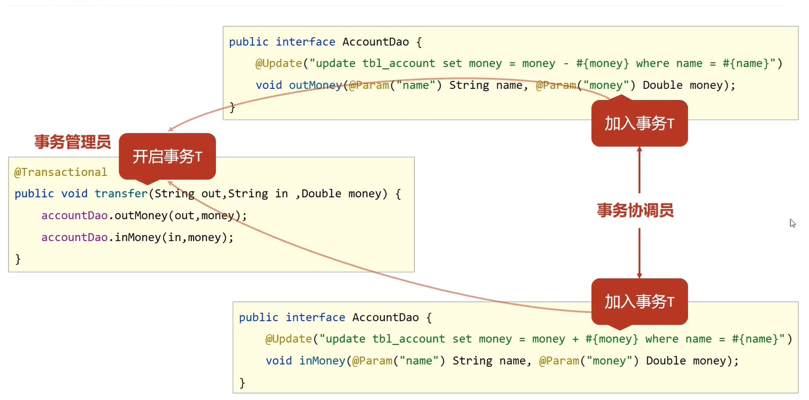
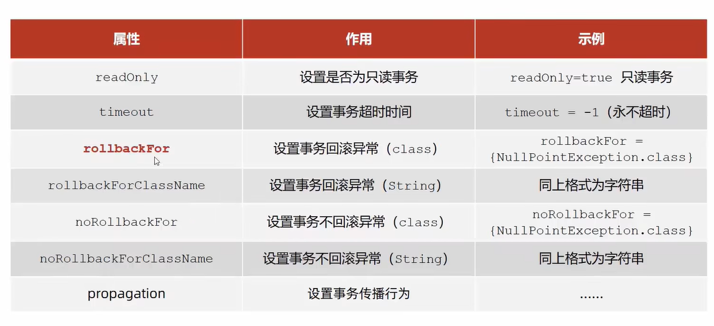
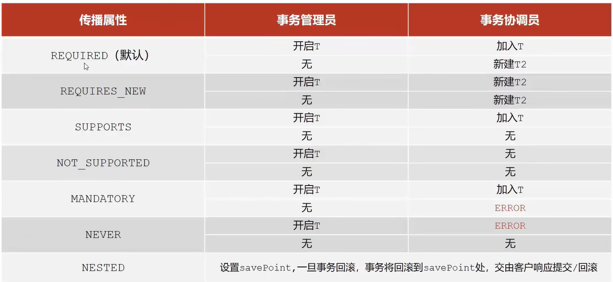

# Spring—事务

在数据层或者业务层保障一系列的数据库操作同成功同失败

## 操作

1. 开启事务（一般在接口上配置）

   ```java
   public interface AccountService{
   	@Transactional
   	public void transfer(String out,String in,Double money);   
   }
   ```

   <font color='red'>`@Transactional`注解不仅可以写在方法上，也可以写在类或接口上，此时这个类或接口的所有方法都会开启事务</font>

2. 配置事务管理器（使用的是JDBC的事务管理器）

   ```java
   @Bean
       public PlatformTransactionManager transactionManager(DataSource dataSource){
           DataSourceTransactionManager transactionManager = new DataSourceTransactionManager();
           transactionManager.setDataSource(dataSource);
           return transactionManager;
       }
   ```

3. 告诉Spring开启注解式事务驱动

   ```java
   @Configuration
   @ComponentScan({"com.cq.config","com.cq.dao","com.cq.service","com.cq.AOP"})
   @PropertySource({"classpath:jdbc.properties"})
   @Import({JdbcConfig.class,MybatisConfig.class})
   @EnableTransactionManagement
   public class SpringConfig {
   
   }
   ```

## 事务角色

- 事务管理员：发起事务方，在Spring中通常指代业务层开启事务的方法
- 事务协调员：加入事务方，在Spring中通常指代数据层方法，也可以是业务层方法



## 事务相关配置

<font color='red'>默认不回滚IOException和Error，如果需要的话，要自己加上</font>



```java
public interface AccountService{
    @Transactional(readOnly = true,rollbackFor = {IOException.class,Error.class})
    public void transfer(String out,String in,Double money) throws IOException;
}
```

## 事务传播行为

- 事务协调员对事务管理员所携带事务的处理态度

  

```java
pubic interface LogService{
    @Transactional(propagation = Propagation.REQUIRES_NEW)
    void log(String out,String in,Double money);
}
```

```java
@Service
public class AccountServiceImpl{
    @AutoWired
    private LogService logService;
    public void transfer(String out,String in,Double money) throws IOException{
    	try{
            accountDao.outMoney(out,in,money);
            int i = 1/0;
            accountDao.inMoney(out,in,money);
        }finally{
            logService.log(out,in,money);
        }
    }
}
```

