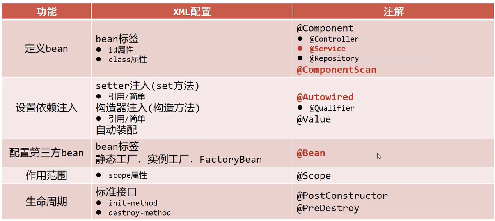

# Spring—注解、AOP、事务

## 注解开发

### 注解开发定义bean

- 使用@Component定义bean

  ```java
  @Component("bookDao")
  public class BookDaoImpl implements BookDao {
  }
  ```

- xml配置文件中通过组件扫描加载bean

  ```xml
  <context:component-scan base-package="com.cq"/>
  ```

- 三个衍生注解

  - @Controller：用于表现层bean定义
  - @Service：用于业务层bean定义
  - @Repository：用于数据层bean定义

### 纯注解开发

- java类替代Spring核心配置文件

  ```java
  @Configuration
  @ComponentScan("com.cq")
  public class SpringConfig {
  }
  ```

- @Configuration注解用于设置当前类为注解类

- @ComponentScan注解用于设定扫描路径，此注解只能添加一次，多个数据可用数组模式

  ```java
  @ComponentScan({"com.cq.dao","com.cq.service"})
  ```

- 读取Spring核心文件初始化容器对象切换为读取Java配置类初始化容器对象

  ```java
  ApplicationContext ctx = new AnnotationConfigApplicationContext(SpringConfig.class);
  ```

### bean管理

#### bean作用范围

- 使用@Scope定于bean的作用范围，`prototype` 、`singleton`

  ```java
  @Repository("bookDao")
  @Scope("prototype")
  public class BookDaoImpl implements BookDao {
  ```

#### bean生命周期

- 先配置注解的maven

  ```xml
          <dependency>
              <groupId>javax.annotation</groupId>
              <artifactId>javax.annotation-api</artifactId>
              <version>1.3.2</version>
          </dependency>
  ```

- 使用 @PostConstruct、@PreDestroy定义生命周期

```java
@Service("bookService")
@Scope("singleton")
public class BookServiceImpl implements BookService {
    private BookDao bookDao;
    
    public void setBookDao(BookDao bookDao) {
        this.bookDao = bookDao;
    }

    @PreDestroy
    public void destroy() throws Exception {
        System.out.println("server destroy");
    }

    @PostConstruct
    public void afterPropertiesSet() throws Exception {
        System.out.println("server afterPropertiesSet");
    }

    @Override
    public void save() {
        bookDao.save();
        System.out.println("bookDaoServer save...");
    }
}
```

### 依赖注入

#### 自动装配

##### 按类型注入

- 使用@Autowired注解开启自动装配模式（按类型）

  ```java
  @Service("bookService")
  @Scope("singleton")
  public class BookServiceImpl implements BookService {
      @Autowired
      private BookDao bookDao;
  
      @Override
      public void save() {
          bookDao.save();
          System.out.println("bookDaoServer save...");
      }
  }
  ```

##### 按名称注入

- 使用@Qualifier注解开启指定名称装配bean(按名称)

  ```java
  @Service("bookService")
  @Scope("singleton")
  public class BookServiceImpl implements BookService {
      @Autowired
      @Qualifier("bookDao")
      private BookDao bookDao;
  }
  ```

##### 简单值注入

- 使用@Value注解注入对象的基本数据类型和String类型的成员变量值

  ```java
  @Repository("bookDao")
  public class BookDaoImpl implements BookDao {
      @Value("100")
      private int connectionNum;
      @Value("mysql")
      private String databaseName;
  }
  ```

##### 加载Properties文件

- 使用@PropertiesSource注解加载Properties文件`@PropertySource({"jdbc.properties"})`或者``@PropertySource("classpath:jdbc.properties")`

  ```java
  @Configuration
  @ComponentScan("com.cq")
  @PropertySource({"jdbc.properties"})
  public class SpringConfig {
  }
  ```

  ```java
  public class BookDaoImpl implements BookDao {
      @Value("1000")
      private int connectionNum;
      @Value("${jdbc.driver}")
      private String databaseName;
  }
  ```

- 注意路径仅支持单一文件配置，多文件需使用数组格式配置，不允许使用通配符

##### 注意事项

- 自动装配基于反射设计创建对象并暴力反射对应属性为私有属性初始化数据，因此无需提供setter方法
- 自动装配建议使用无参构造方法创建对象（默认），若不能提供对应构造方法，请提供唯一的构造方法
- @Qualifier注解无法单独使用，必须配合@Autowired注解使用
- @PropertiesSource注解使用时，路径仅支持单一文件配置，多文件需使用数组格式配置，不允许使用通配符

### 第三方bean管理

#### 方式一：引入式

```java
@Configuration
@ComponentScan("com.cq")
@PropertySource({"classpath:jdbc.properties"})
@Import({JdbcConfig.class})
public class SpringConfig {

}
```

```java
public class JdbcConfig {
    //1.定义一个方法获得第三方要管理的对象
    //2.添加@Bean，表示当前方法的返回值是一个bean
    @Bean
    public DataSource dataSource(){
        DruidDataSource ds = new DruidDataSource();
        ds.setDriverClassName("com.mysql.jdbc.Driver");
        ds.setUrl("jdbc:mysql://localhost:3306/myfriend");
        ds.setUsername("root");
        ds.setPassword("root");
        return ds;
    }
}
```

#### 方式二：扫描式

```java
@Configuration
@ComponentScan("com.cq.config")
@PropertySource({"classpath:jdbc.properties"})
//@Import({JdbcConfig.class})
public class SpringConfig {

}
```

```java
@Configuration
public class JdbcConfig {
    //1.定义一个方法获得第三方要管理的对象
    //2.添加@Bean，表示当前方法的返回值是一个bean
    @Bean
    public DataSource dataSource(){
        DruidDataSource ds = new DruidDataSource();
        ds.setDriverClassName("com.mysql.jdbc.Driver");
        ds.setUrl("jdbc:mysql://localhost:3306/myfriend");
        ds.setUsername("root");
        ds.setPassword("root");
        return ds;
    }
}
```

#### 简单类型

```java
public class JdbcConfig {
    @Value("${jdbc.driver}")
    private String driver;
    @Value("${jdbc.url}")
    private String url;
    @Value("${jdbc.username}")
    private String username;
    @Value("${jdbc.password}")
    private String password;

    //1.定义一个方法获得第三方要管理的对象
    //2.添加@Bean，表示当前方法的返回值是一个bean
    @Bean
    public DataSource dataSource(){
        DruidDataSource ds = new DruidDataSource();
        ds.setDriverClassName(driver);
        ds.setUrl(url);
        ds.setUsername(username);
        ds.setPassword(password);
        return ds;
    }
}
```

#### 引用类型

- 引用类型注入只需要为bean定义方法设置形参即可，容器会根据类型自动装配对象

```java
public class JdbcConfig {
    //1.定义一个方法获得第三方要管理的对象
    //2.添加@Bean，表示当前方法的返回值是一个bean
    @Bean
    public DataSource dataSource(BookDao bookDao){
        System.out.println(bookDao);
        DruidDataSource ds = new DruidDataSource();
        //属性设置
        return ds;
    }
}
```

### XML配置与注解配置对比



## Spring整合MyBatis

