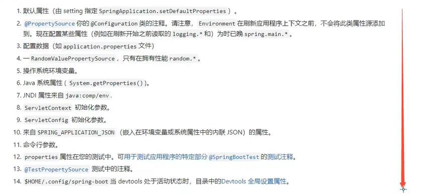

# SpringBoot

- 打jar包的插件，，springboot默认具有

  ```xml
      <build>
          <plugins>
              <plugin>
                  <groupId>org.springframework.boot</groupId>
                  <artifactId>spring-boot-maven-plugin</artifactId>
              </plugin>
          </plugins>
      </build>
  ```
  
- spring程序缺点：配置繁琐、依赖设置繁琐

- springboot程序优点：自动配置、起步依赖（简化依赖配置）、辅助功能（内置服务器......)

## 起步依赖

```xml
<?xml version="1.0" encoding="UTF-8"?>
<project xmlns="http://maven.apache.org/POM/4.0.0" xmlns:xsi="http://www.w3.org/2001/XMLSchema-instance"
	xsi:schemaLocation="http://maven.apache.org/POM/4.0.0 https://maven.apache.org/xsd/maven-4.0.0.xsd">
	<modelVersion>4.0.0</modelVersion>
	<parent>
		<groupId>org.springframework.boot</groupId>
		<artifactId>spring-boot-starter-parent</artifactId>
		<version>2.7.3</version>
	</parent>
	<groupId>com.cq</groupId>
	<artifactId>springboot_demo</artifactId>
	<version>0.0.1-SNAPSHOT</version>
	<properties>
		<java.version>11</java.version>
	</properties>
	<dependencies>
		<dependency>
			<groupId>org.springframework.boot</groupId>
			<artifactId>spring-boot-starter-web</artifactId>
		</dependency>
	</dependencies>
</project>
```

- starter：定义了当前项目使用的所有项目坐标，达到<font color='red'>减少依赖配置</font>的目的
- parent：所有springboot项目要继承的项目，定义了若干个坐标版本号（依赖管理，而非依赖），达到<font color='red'>减少依赖冲突</font>的目的
- 实际开发：使用任意坐标时，仅书写GAV中的G和A，V由springboot提供，当发生坐标错误时再指定version

## 辅助功能

```xml
	<dependencies>
		<dependency>
			<groupId>org.springframework.boot</groupId>
			<artifactId>spring-boot-starter-web</artifactId>
		</dependency>
	</dependencies>
```

## 启动方式

```java
@SpringBootApplication
public class SpringbootDemoApplication {

	public static void main(String[] args) {
		SpringApplication.run(SpringbootDemoApplication.class, args);
	}
}
```

- springboot在创建项目时，采用jar的打包方式
- springboot的引导类是项目的入口，运行main方法就可以启动项目

## 变更起步依赖

```xml
	<dependencies>
		<dependency>
			<groupId>org.springframework.boot</groupId>
			<artifactId>spring-boot-starter-web</artifactId>
<!--			web起步依赖环境中，排除Tomcat起步依赖-->
			<exclusions>
				<exclusion>
					<groupId>org.springframework.boot</groupId>
					<artifactId>spring-boot-starter-tomcat</artifactId>
				</exclusion>
			</exclusions>
		</dependency>
<!--		添加Jetty起步依赖，版本由springboot的starter控制-->
		<dependency>
			<groupId>org.springframework.boot</groupId>
			<artifactId>spring-boot-starter-jetty</artifactId>
		</dependency>
	</dependencies>
```

## 基础配置

### 配置格式

- application.properties

  ```xml
  server.port=80
  ```

- application.yml

  ```xml
  server:
    port: 81
  ```

- application.yaml

  ```xml
  server:
    port: 82
  ```

- 优先级：properties>yml>yaml

### yaml

#### 优点

- 容易阅读

- 以数据为核心，重数据轻格式
- 容易与脚本语言交互

#### 语法规则

- 大小写敏感

- 属性层级关系使用多行描述，每行结尾使用冒号结束

- 使用缩进表示层级关系，同层级左侧对齐，只允许使用空格（不允许使用Tab键）

- 属性值前面加空格（属性名与属性值之间使用冒号+空格作为分隔）

- \#表示注释

- 数组数据在书写位置下方使用减号作为数据开始符号，每行书写一个数据，减号与数据间空格分隔

  ```xml
  likes:
    - java
    - music
    - travel
  ```

### yaml数据读取

```yaml
server:
  port: 80

lesson: SpringBoot
enterprise:
  name: cq
  age: 20
  tel: 123456768
  subject:
    - Java
    - 前端
    - 大数据
```

#### 使用@Value读取单个数据

- 属性名引用方式：${一级属性名.二级属性名...}

```java
@RestController
@RequestMapping("/friends")
public class FriendController {
    @Value("${lesson}")
    private String lesson;
    
    @Value("${server.port}")
    private Integer port;
    
    @Value("${enterprise.subject[0]}")
    private String subject_0;
    
    @GetMapping("/{id}")
    public String getById(@PathVariable Integer id) {
        System.out.println(lesson+port+subject_0);
        return "hello, spring boot!";
    }
}
```

#### 封装全部数据到Environment对象

```java
@RestController
@RequestMapping("/friends")
public class FriendController {
    @Autowired
    private Enterprise enterprise;

    @GetMapping("/{id}")
    public String getById(@PathVariable Integer id) {
        System.out.println(environment.getProperty("lesson"));
        System.out.println(environment.getProperty("server.port"));
        System.out.println(environment.getProperty("enterprise.subject[0]"));
        return "hello, spring boot!";
    }
}
```

#### 自定义对象封装指定数据

```java
@Component
@ConfigurationProperties(prefix = "enterprise")
public class Enterprise {
    private String name;
    private Integer  age;
    private String tel;
    private String[] subject;
}
```

```java
@RestController
@RequestMapping("/friends")
public class FriendController {
    @Autowired
    private Enterprise enterprise;
}
```

#### 自定义对象封装数据警告解决方案

```xml
		<dependency>
			<groupId>org.springframework.boot</groupId>
			<artifactId>spring-boot-configuration-processor</artifactId>
			<optional>true</optional>
		</dependency>
```

## 多环境开发

### 多环境启动

- 方式一：

  ```yaml
  #设置启用的环境
  spring:
    profiles:
      active: dev
  
  ---
  #开发
  spring:
    config:
      activate:
        on-profile: dev
  server:
    port: 81
  
  ---
  #生产
  server:
    port: 80
  spring:
    profiles: pro
  
  ---
  #测试
  server:
    port: 82
  spring:
    profiles: test
  ```

- 方式二

  - 主启动配置文件application.properties

    ```properties
    # 设置启用的环境
    spring.profiles.active=dev
    ```

  - 环境分类配置文件application-pro.properties

    ```properties
    server.port=8082
    ```

  - 环境分类配置文件application-dev.properties

    ```properties
    server.port=8081
    ```

  - 环境分类配置文件application-test.properties

    ```properties
    server.port=8083
    ```

### 多环境启动命令格式

- 带参数启动springboot

  ```
  java -jar springboot_demo.jar --spring.profiles.active=test
  ```

  ```
  java -jar springboot_demo.jar --server.port=88
  ```

  ```
  java -jar springboot_demo.jar --server.port=88 --spring.profiles.active=test
  ```

- 属性配置优先级，由低到高

  

### 多环境开发控制

- maven与springboot多环境兼容

1. maven中设置多环境属性

   ```xml
   	<profiles>
   		<profile>
   			<id>dev</id>
   			<properties>
   				<profile.active>dev</profile.active>
   			</properties>
   		</profile>
   
   		<profile>
   			<id>pro</id>
   			<properties>
   				<profile.active>pro</profile.active>
   			</properties>
   			<activation>
   				<activeByDefault>true</activeByDefault>
   			</activation>
   		</profile>
   
   		<profile>
   			<id>test</id>
   			<properties>
   				<profile.active>test</profile.active>
   			</properties>
   		</profile>
   	</profiles>
   ```

2. springboot中引用maven属性

   ```yaml
   #设置启用的环境
   spring:
     profiles:
       active: ${profile.active}
   
   ---
   #开发
   spring:
     config:
       activate:
         on-profile: dev
   server:
     port: 81
   
   ---
   #生产
   server:
     port: 80
   spring:
     profiles: pro
   
   ---
   #测试
   server:
     port: 82
   spring:
     profiles: test
   ```

3. 在maven中加入对资源文件开启默认占位符的解析插件

   ```xml
   	<build>
   		<plugins>
   			<plugin>
   				<groupId>org.springframework.boot</groupId>
   				<artifactId>spring-boot-maven-plugin</artifactId>
   			</plugin>
   			<plugin>
   				<groupId>org.apache.maven.plugins</groupId>
   				<artifactId>maven-resources-plugin</artifactId>
   				<version>3.2.0</version>
   				<configuration>
   					<encoding>UTF-8</encoding>
   					<useDefaultDelimiters>true</useDefaultDelimiters>
   				</configuration>
   			</plugin>
   		</plugins>
   	</build>
   ```

## 配置文件分类

- 4级配置文件

  1级：file:config/application.yml <font color='red'>最高</font>(jar包路径下)

  2级：file:application.yml

  3级：classpath:config/application.yml(类路径下)

  4级：classpath:application.yml <font color='red'>最低</font>

- 作用

  - 1级与2级留做系统打包后设置通用属性
  - 3级与4级用于系统开发阶段设置通用属性

## 整合第三方技术

### 整合JUnit

```java
@SpringBootTest
class SpringbootDemoApplicationTests {

	@Autowired
	private BookService bookService;
	@Test
	void contextLoads() {
		bookService.save();
	}
}
```

#### @SpringBootTest

- 测试类注解

- 设置JUnit加载的SpringBoot启动类

- 例：

  ```java
  @SpringBootTest(classes = SpringbootDemoApplication.class)
  class SpringbootDemoApplicationTests {
  }
  ```

- classes：设置SpringBoot启动类

<font color='red'>如果测试类在SpringBoot启动类的包或子包中，可以省略启动类的设置，也就是省略classes的设定</font>

### 实现SSM整合

- SpringBoot整合Spring（不存在）

- SpringBoot整合SpringMVC（不存在）

- SpringBoot整合MyBatis（主要）

  1. 设置数据源参数

  ```yaml
  spring:
    datasource:
      driver-class-name: com.mysql.jdbc.Driver
      url: jdbc:mysql://localhost:3306/myfriend?serverTimezone=UTC
      username: root
      password: root
      type: com.alibaba.druid.pool.DruidDataSource
  ```

  2. 定义数据层接口与映射配置

  ```java
  @Mapper
  public interface FriendDao {
      @Insert("insert into myfriend values(null,#{userid},#{name},#{sex},#{age},#{qq},#{telephone},#{email},#{address})")
      public int save(Friend friend);
      @Update("update myfriend set age=#{gae}, name=#{name}, address=#{address} where id=#{id}")
      public int update(Friend friend);
      @Delete("delete from myfriend where id=#{id}")
      public int delete(Integer id);
      @Select("select * from myfriend where id=#{id}")
      public Friend getById(Integer id);
      @Select("select * from myfriend")
      public List<Friend> getAll();
  }
  ```

### 整合流程

1. pom.xml

   配置起步依赖，必要的资源坐标（druid）

2. application.xml

   设置数据源、端口等

3. 配置类

   不需要，全删除

4. dao

   设置@Mapper

5. 测试类

6. 页面


