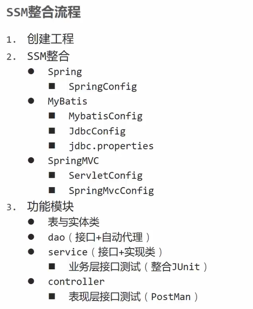
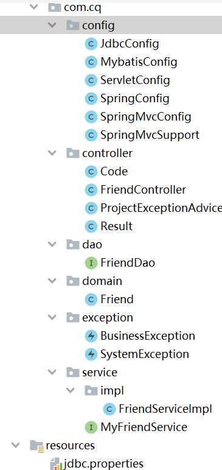
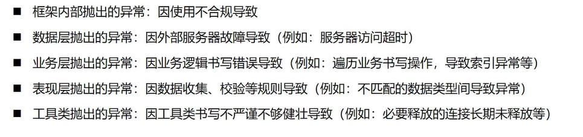

# SpringMVC—SSM整合

## 整合流程





## 导入的jar包

```xml
<?xml version="1.0" encoding="UTF-8"?>

<project xmlns="http://maven.apache.org/POM/4.0.0" xmlns:xsi="http://www.w3.org/2001/XMLSchema-instance"
  xsi:schemaLocation="http://maven.apache.org/POM/4.0.0 http://maven.apache.org/xsd/maven-4.0.0.xsd">
  <modelVersion>4.0.0</modelVersion>

  <groupId>com.cq</groupId>
  <artifactId>springmvc_ssm</artifactId>
  <version>1.0-SNAPSHOT</version>
  <packaging>war</packaging>
    
  <properties>
    <project.build.sourceEncoding>UTF-8</project.build.sourceEncoding>
    <maven.compiler.encoding>UTF-8</maven.compiler.encoding>
    <java.version>11</java.version>
    <maven.compiler.source>11</maven.compiler.source>
    <maven.compiler.target>11</maven.compiler.target>
  </properties>
    
  <dependencies>
    <dependency>
      <groupId>junit</groupId>
      <artifactId>junit</artifactId>
      <version>4.12</version>
      <scope>test</scope>
    </dependency>
    <dependency>
      <groupId>org.springframework</groupId>
      <artifactId>spring-webmvc</artifactId>
      <version>5.2.10.RELEASE</version>
    </dependency>
    <dependency>
      <groupId>org.springframework</groupId>
      <artifactId>spring-jdbc</artifactId>
      <version>5.2.10.RELEASE</version>
    </dependency>
    <dependency>
      <groupId>org.springframework</groupId>
      <artifactId>spring-test</artifactId>
      <version>5.2.10.RELEASE</version>
    </dependency>
    <dependency>
      <groupId>org.mybatis</groupId>
      <artifactId>mybatis</artifactId>
      <version>3.5.6</version>
    </dependency>
    <dependency>
      <groupId>org.mybatis</groupId>
      <artifactId>mybatis-spring</artifactId>
      <version>1.3.0</version>
    </dependency>
    <dependency>
      <groupId>mysql</groupId>
      <artifactId>mysql-connector-java</artifactId>
      <version>5.1.47</version>
    </dependency>
    <dependency>
      <groupId>com.alibaba</groupId>
      <artifactId>druid</artifactId>
      <version>1.1.16</version>
    </dependency>
    <dependency>
      <groupId>com.fasterxml.jackson.core</groupId>
      <artifactId>jackson-databind</artifactId>
      <version>2.9.0</version>
    </dependency>
    <dependency>
      <groupId>javax.servlet</groupId>
      <artifactId>javax.servlet-api</artifactId>
      <version>3.1.0</version>
    </dependency>
  </dependencies>
  <!--  导入tomcat坐标-->
  <build>
    <plugins>
      <plugin>
        <groupId>org.apache.tomcat.maven</groupId>
        <artifactId>tomcat7-maven-plugin</artifactId>
        <version>2.1</version>
        <configuration>
          <port>80</port>
          <path>/</path>
        </configuration>
      </plugin>
    </plugins>
  </build>

</project>
```

## 表现层数据封装

- 设置统一数据返回结果类

  ```java
  public class Result {
      private Object data;
      private Integer code;
      private String msg;
  
      public Result(Integer code,Object data) {
          this.data = data;
          this.code = code;
      }
  
      public Result() {
      }
  
      public Result(Integer code, Object data, String msg) {
          this.data = data;
          this.code = code;
          this.msg = msg;
      }
  }
  ```

- 设置统一数据返回结果编码

  ```java
  public class Code {
      public static final Integer SAVE_OK = 20011;
      public static final Integer DELETE_OK = 20021;
      public static final Integer UPDATE_OK = 20031;
      public static final Integer GET_OK = 20041;
      public static final Integer SAVE_ERR = 20010;
      public static final Integer DELETE_ERR = 20020;
      public static final Integer UPDATE_ERR = 20030;
      public static final Integer GET_ERR = 20040;
  }
  ```

## 异常处理器

### 异常诱因



- 所有异常均抛出到表现层进行处理
- 使用AOP处理

### 处理器@RestControllerAdvice

```java
@RestControllerAdvice
public class ProjectExceptionAdvice {
    @ExceptionHandler(Exception.class)//拦截异常
    public Result doException(Exception ex){
        ex.printStackTrace();
        return new Result(400,null,"出错了");
    }
}
```

## 项目异常处理

### 自定义项目系统级异常

```java
public class SystemException extends RuntimeException {
    private Integer code;

    public Integer getCode() {
        return code;
    }

    public void setCode(Integer code) {
        this.code = code;
    }

    public SystemException(Integer code, String message) {
        super(message);
        this.code = code;
    }

    public SystemException(Integer code, String message, Throwable cause) {
        super(message, cause);
        this.code = code;
    }

}
```

### 自定义业务级异常

```java
public class BusinessException extends RuntimeException {
    private Integer code;

    public Integer getCode() {
        return code;
    }

    public void setCode(Integer code) {
        this.code = code;
    }

    public BusinessException(Integer code, String message) {
        super(message);
        this.code = code;
    }

    public BusinessException(Integer code, String message, Throwable cause) {
        super(message, cause);
        this.code = code;
    }

}
```

### 自定义异常编码

```java
public class Code {
    public static final Integer SAVE_OK = 20011;
    public static final Integer DELETE_OK = 20021;
    public static final Integer UPDATE_OK = 20031;
    public static final Integer GET_OK = 20041;

    public static final Integer SAVE_ERR = 20010;
    public static final Integer DELETE_ERR = 20020;
    public static final Integer UPDATE_ERR = 20030;
    public static final Integer GET_ERR = 20040;

    public static final Integer SYSTEM_UNKNOW_ERR = 50001;
    public static final Integer SYSTEM_TIMEOUT_ERR = 50002;
    public static final Integer BUSINESS_ERR = 60002;

}
```

### 触发自定义异常

```java
    public Friend getById(Integer id) {
        if (id==1){
            throw new BusinessException(Code.BUSINESS_ERR,"请不要挑战我的专业性");
        }
        //将可能出现的异常进行包装，转换为自定义异常
        try {
            int i = 1/0;
        }catch (Exception e){
            throw new SystemException(Code.SYSTEM_TIMEOUT_ERR,"服务器访问超时，请重试");
        }
        return friendDao.getById(id);
    }
```

### 拦截并处理异常

```java
@RestControllerAdvice
public class ProjectExceptionAdvice {
    @ExceptionHandler(SystemException.class)
    public Result doSystemException(SystemException ex){
        //记录日志
        //发送消息给运维
        //发送邮件给开发人员，ex对象发送给开发人员
        ex.printStackTrace();
        return new Result(ex.getCode(),null,ex.getMessage());
    }

    @ExceptionHandler(BusinessException.class)
    public Result doBusinessException(BusinessException ex){
        ex.printStackTrace();
        return new Result(ex.getCode(),null,ex.getMessage());
    }

    @ExceptionHandler(Exception.class)
    public Result doException(Exception ex){
        ex.printStackTrace();
        return new Result(Code.SYSTEM_UNKNOW_ERR,null,"系统繁忙，请稍后再试！");
    }
}
```

## 补充代码

### Dao层

```java
public interface FriendDao {
    @Insert("insert into myfriend values(null,#{userid},#{name},#{sex},#{age},#{qq},#{telephone},#{email},#{address})")
    public int save(Friend friend);
    @Update("update myfriend set age=#{gae}, name=#{name}, address=#{address} where id=#{id}")
    public int update(Friend friend);
    @Delete("delete from myfriend where id=#{id}")
    public int delete(Integer id);
    @Select("select * from myfriend where id=#{id}")
    public Friend getById(Integer id);
    @Select("select * from myfriend")
    public List<Friend> getAll();
}
```

### Service层

#### 接口

```java
@Transactional
public interface MyFriendService {
    /**
     * 保存
     * @param friend
     * @return
     */
    public boolean save(Friend friend);

    /**
     * 更新
     * @param friend
     * @return
     */
    public boolean update(Friend friend);

    /**
     * 根据id删除
     * @param id
     * @return
     */
    public boolean delete(Integer id);

    /**
     * 根据id查询
     * @param id
     * @return
     */
    public Friend getById(Integer id);

    /**
     * 查询所有
     * @return
     */
    public List<Friend> getAll();
}
```

#### 实现类

```java
@Service
public class FriendServiceImpl implements MyFriendService {
    @Autowired
    private FriendDao friendDao;
    public boolean save(Friend friend) {

        return friendDao.save(friend)>0;
    }

    public boolean update(Friend friend) {

        return friendDao.update(friend)>0;
    }

    public boolean delete(Integer id) {

        return friendDao.delete(id)>0;
    }

    public Friend getById(Integer id) {
        if (id==1){
            throw new BusinessException(Code.BUSINESS_ERR,"请不要挑战我的专业性");
        }
        //将可能出现的异常进行包装，转换为自定义异常
        try {
            int i = 1/0;
        }catch (Exception e){
            throw new SystemException(Code.SYSTEM_TIMEOUT_ERR,"服务器访问超时，请重试");
        }
        return friendDao.getById(id);
    }

    public List<Friend> getAll() {
        return friendDao.getAll();
    }
}
```

