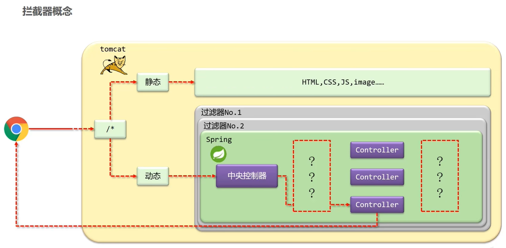
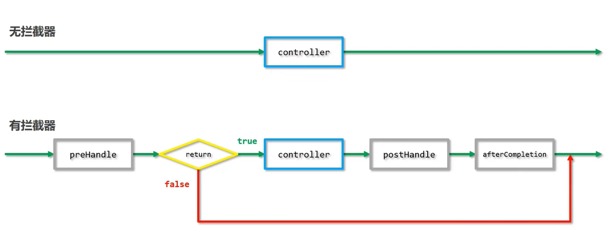
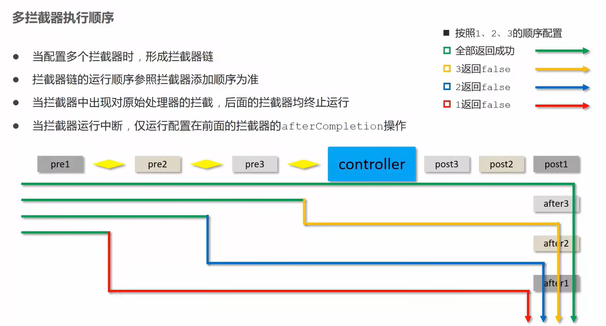

# SpringMVC—拦截器



- 作用
  - 在指定的方法调用前后执行预先设定的代码
  - 阻止原始方法的执行

## 拦截器与过滤器的区别

- 归属不同：Filter属于Servlet技术，Interceptor属于SpringMVC技术
- 拦截内容不同：Filter对所有访问进行增强，Interceptor仅针对SpringMVC的访问进行增强

## 简单使用

1. 声明拦截器的bean，并实现HandlerInterceptor接口，注意扫描加载bean

   ```java
   @Component
   public class ProjectInterceptor implements HandlerInterceptor {
       @Override
       public boolean preHandle(HttpServletRequest request, HttpServletResponse response, Object handler) throws Exception {
           System.out.println("preHandle...");
           return true;
       }
   
       @Override
       public void postHandle(HttpServletRequest request, HttpServletResponse response, Object handler, ModelAndView modelAndView) throws Exception {
           System.out.println("postHandle...");
       }
   
       @Override
       public void afterCompletion(HttpServletRequest request, HttpServletResponse response, Object handler, Exception ex) throws Exception {
           System.out.println("afterCompletion...");
       }
   }
   ```

2. 定义配置类，继承WebMvcConfigurationSupport，实现addInterceptor方法，注意扫描加载配置

3. 添加拦截器，并设定拦截器的访问路径，路径可以通过可变参数设置多个

   ```java
   @Configuration
   public class SpringMvcSupport extends WebMvcConfigurationSupport {
       @Autowired
       private ProjectInterceptor projectInterceptor;
       @Override
       protected void addResourceHandlers(ResourceHandlerRegistry registry) {
           registry.addResourceHandler("/page/**").addResourceLocations("/pages/");
           registry.addResourceHandler("/css/**").addResourceLocations("/css/");
           registry.addResourceHandler("/js/**").addResourceLocations("/js/");
           registry.addResourceHandler("/plugins/**").addResourceLocations("/plugins/");
       }
   
       @Override
       protected void addInterceptors(InterceptorRegistry registry) {
           registry.addInterceptor(projectInterceptor).addPathPatterns("/friends","/users/*");
       }
   }
   ```

## 简化配置

- 使用标准接口WebMvcConfigurer简化开发（注意：侵入式较强）

```java
@Configuration
@ComponentScan({"com.cq.controller"})
@EnableWebMvc
public class SpringMvcConfig implements WebMvcConfigurer {
    @Autowired
    private ProjectInterceptor projectInterceptor;
    @Override
    public void addResourceHandlers(ResourceHandlerRegistry registry) {
        registry.addResourceHandler("/page/**").addResourceLocations("/pages/");
        registry.addResourceHandler("/css/**").addResourceLocations("/css/");
        registry.addResourceHandler("/js/**").addResourceLocations("/js/");
        registry.addResourceHandler("/plugins/**").addResourceLocations("/plugins/");
    }

    @Override
    public void addInterceptors(InterceptorRegistry registry) {
        registry.addInterceptor(projectInterceptor).addPathPatterns("/friends","/users/*");
    }
}
```

## 执行流程



## 拦截器参数

### 前置处理

```java
@Override
public boolean preHandle(HttpServletRequest request, HttpServletResponse response, Object handler) throws Exception {
    String header = request.getHeader("Content-Type");
    HandlerMethod hm = (HandlerMethod) handler;
    hm.getMethod();
    System.out.println("preHandle..."+header);
    return true;
}
```

- 参数
  - request：请求对象
  - response：响应对象
  - handler：被调用的处理器对象，本质上是一个方法对象，对反射技术中的Method对象进行了再包装
- 返回值
  - 返回值为false，被拦截的处理不执行

### 后置处理

```java
@Override
public void postHandle(HttpServletRequest request, HttpServletResponse response, Object handler, ModelAndView modelAndView) throws Exception {
    System.out.println("postHandle...");
}
```

- 参数
  - modelAndView：如果处理器执行完成具有返回结果，可以读取到对应数据与页面信息，并进行调整

### 完成后处理

```java
@Override
public void afterCompletion(HttpServletRequest request, HttpServletResponse response, Object handler, Exception ex) throws Exception {
    System.out.println("afterCompletion...");
}
```

- 参数
  - ex：如果处理器执行过程中出现异常对象，可以针对异常情况进行单独处理

## 多拦截器执行顺序

- 当配置多个拦截器时，形成拦截器链
- 拦截器链的运行顺序参照拦截器添加顺序为准
- 当拦截器中出现对原始处理器的拦截，后面的拦截器均终止运行
- 当拦截器运行中断，仅运行配置在前面的拦截器的afterCompletion操作



小结：

1. preHandle：与配置顺序相同，必定运行
2. postHandle：与配置顺序相反，可能不运行
3. afterCompletion：与配置顺序相反，可能不运行