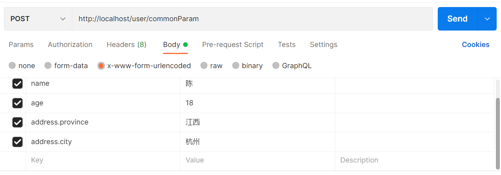
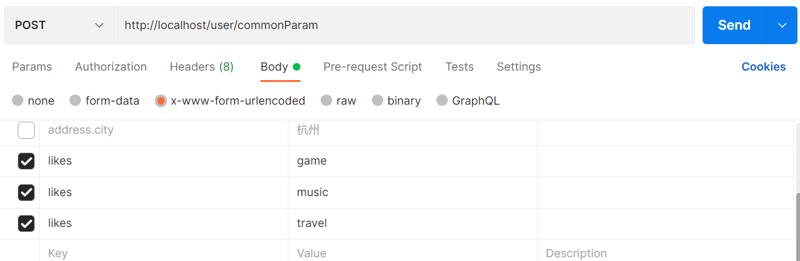
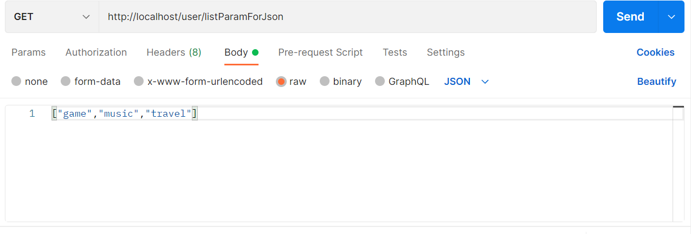
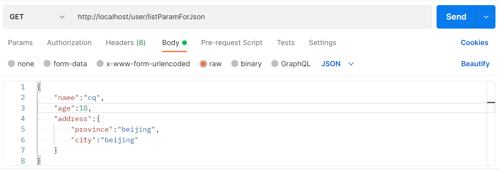
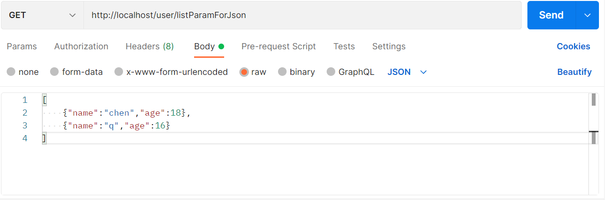
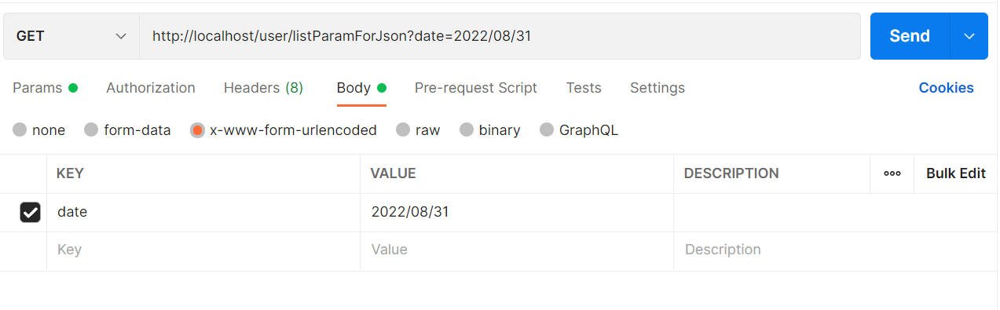
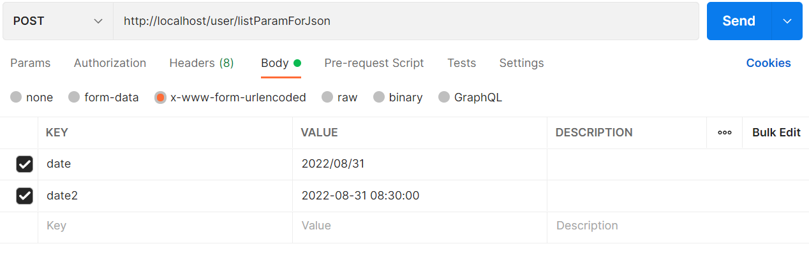
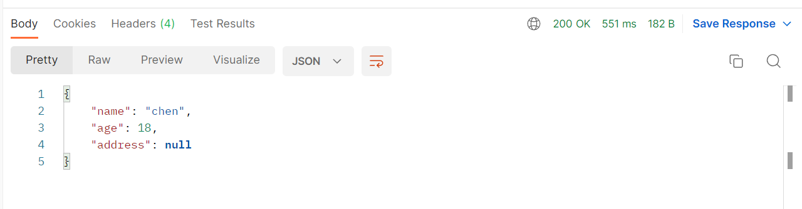

# SpringMVC—请求与响应

## 设置请求路径映射

```java
@Controller
@RequestMapping("/user")
public class UserController {
    //设置当前操作的访问路径
    @RequestMapping("/save")
    //设置当前操作的返回值类型
    @ResponseBody
    public String save(){
        System.out.println("user save...");
        return "{'module':'springmvc'}";
    }

    @RequestMapping("/delete")
    @ResponseBody
    public void delete(){
        System.out.println("user delete...");
    }
}
```

## Get请求和Post请求

```java
@RequestMapping("/commonParam")
    @ResponseBody
    public String commonParam(String name){
        System.out.println("普通参数传递 name==》"+name);
//        System.out.println("commonParam");
        return "{'module':'common param'}";
    }
```

Post请求乱码处理：在ServletContainerInitConfig中添加如下代码，Spring-web包提供了专用的字符过滤器

```java
public class ServletContainerInitConfig extends AbstractAnnotationConfigDispatcherServletInitializer {
    //乱码处理
    @Override
    protected Filter[] getServletFilters() {
        CharacterEncodingFilter filter = new CharacterEncodingFilter();
        filter.setEncoding("UTF-8");
        return new Filter[]{filter};
    }
}
```

## 5种类型参数传递

### 普通参数：请求参数名与形参名不同

```java
@RequestMapping("/commonParam")
@ResponseBody
public String commonParam(@RequestParam("name") String name){
    System.out.println("普通参数传递 name==》"+name);
    return "{'module':'common param'}";
}
```

### POJO参数



```java
public class User {
    private String name;
    private int age;

    private Address address;

    @Override
    public String toString() {
        return "User{" +
                "name='" + name + '\'' +
                ", age=" + age +
                ", address=" + address +
                '}';
    }

    public Address getAddress() {
        return address;
    }

    public void setAddress(Address address) {
        this.address = address;
    }

    public String getName() {
        return name;
    }

    public void setName(String name) {
        this.name = name;
    }

    public int getAge() {
        return age;
    }

    public void setAge(int age) {
        this.age = age;
    }
}
```

```java
@RequestMapping("/commonParam")
@ResponseBody
public String commonParam(User user){
    System.out.println(user.toString());
    return "{'module':'common param'}";
}
```

### 数组参数



```java
@RequestMapping("/commonParam")
@ResponseBody
public String commonParam(String[] likes){
    System.out.println(Arrays.toString(likes));
    return "{'module':'common param'}";
}
```

### 集合参数


```java
@RequestMapping("/commonParam")
@ResponseBody
public String commonParam(@RequestParam List<String> likes){
    System.out.println(likes);
    return "{'module':'common param'}";
}
```

### @RequestParam

- 绑定请求参数与处理器方法形参间的关系
- 参数：
  - required：是否为必传参数
  - defaultValue：参数默认值

## json数据传递参数

导入json配置

```xml
    <dependency>
      <groupId>com.fasterxml.jackson.core</groupId>
      <artifactId>jackson-databind</artifactId>
      <version>2.9.0</version>
    </dependency>
```

开启json数据转换为json对象的功能

```java
@EnableWebMvc
public class SpringMvcConfig {

}
```

### 集合参数

```java
@RequestMapping("/listParamForJson")
    @ResponseBody
    public String listParamForJson(@RequestBody List<String> likes){
        System.out.println(likes);
        return "{'module':'list common for json param'}";
    }
```

### POJO参数



```java
@RequestMapping("/listParamForJson")
@ResponseBody
public String listParamForJson(@RequestBody User user){
    System.out.println(user.toString());
    return "{'module':'list common for json param'}";
}
```

### 集合里面存引用对象



```java
@RequestMapping("/listParamForJson")
@ResponseBody
public String listParamForJson(@RequestBody List<User> user){
    System.out.println(user.toString());
    return "{'module':'list common for json param'}";
}
```

### @RequestBody与@RequestParam的区别

- @RequestParam用于接收url地址传参，表单传参【application/x-www-form-urlencoded】
- @RequestBody用于接收json数据【application/json】

## 日期类型参数传递



```java
    @RequestMapping("/listParamForJson")
    @ResponseBody
    public String listParamForJson(Date date){
        System.out.println(date);
        return "{'module':'list common for json param'}";
    }
```

- @DateTimeFormat设置格式



```java
@RequestMapping("/listParamForJson")
@ResponseBody
public String listParamForJson(Date date, @DateTimeFormat(pattern = "yyyy-MM-dd HH:mm:ss") Date date2){
    System.out.println(date);
    System.out.println(date2);
    return "{'module':'list common for json param'}";
}
```

## 类型转换器

- Converter接口

  ```java
  public interface Converter<S,T>{
      @Nullable
      T convert(S val1);
  }
  ```

  - 请求参数年龄数据（String-->Integer）
  - 日期格式转换（String-->Date）
  - @EnableWebMvc功能之一：根据类型匹配对应类型转换器

## 响应页面、跳转页面

```java
//响应页面、跳转页面
@RequestMapping("/toJumpPage")
public String toJumpPage(){
    System.out.println("跳转页面");
    return "page.jsp";
}
```

## 响应文本数据

```java
//响应文本数据
@RequestMapping("/toText")
@ResponseBody
public String toText(){
    System.out.println("返回文本数据");
    return "response text";
}
```

## 响应POJO对象

```java
    //响应POJO
    @RequestMapping("/toJsonPojo")
    @ResponseBody
    public User toJsonPojo(){
        System.out.println("返回json对象数据");
        User user = new User();
        user.setAge(18);
        user.setName("chen");
        return user;
    }
```

结果：



## 响应POJO集合对象

```java
    @RequestMapping("/toJsonList")
    @ResponseBody
    public List<User> toJsonList(){
        System.out.println("返回json集合数据");
        User user1 = new User();
        user1.setName("去");
        user1.setAge(18);
        User user2 = new User();
        user2.setAge(20);
        user2.setName("好");
        List<User> list = new ArrayList<>();
        list.add(user1);
        list.add(user2);
        return list;
    }
```

## @ResponseBody

- 设置当前控制器返回值作为响应体
- 由HttpMessageConverter接口帮助转换