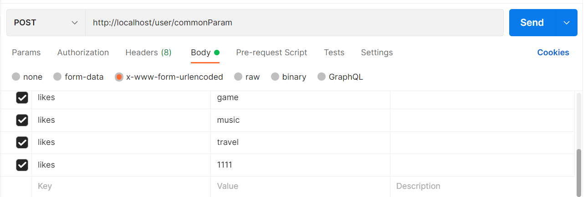

# SpringMVC—请求与响应

## 设置请求路径映射

```java
@Controller
@RequestMapping("/user")
public class UserController {
    //设置当前操作的访问路径
    @RequestMapping("/save")
    //设置当前操作的返回值类型
    @ResponseBody
    public String save(){
        System.out.println("user save...");
        return "{'module':'springmvc'}";
    }

    @RequestMapping("/delete")
    @ResponseBody
    public void delete(){
        System.out.println("user delete...");
    }
}
```

## Get请求和Post请求

```java
@RequestMapping("/commonParam")
    @ResponseBody
    public String commonParam(String name){
        System.out.println("普通参数传递 name==》"+name);
//        System.out.println("commonParam");
        return "{'module':'common param'}";
    }
```

Post请求乱码处理：在ServletContainerInitConfig中添加如下代码，Spring-web包提供了专用的字符过滤器

```java
public class ServletContainerInitConfig extends AbstractAnnotationConfigDispatcherServletInitializer {
    //乱码处理
    @Override
    protected Filter[] getServletFilters() {
        CharacterEncodingFilter filter = new CharacterEncodingFilter();
        filter.setEncoding("UTF-8");
        return new Filter[]{filter};
    }
}
```

## 5种类型参数传递

### 普通参数：请求参数名与形参名不同

```java
@RequestMapping("/commonParam")
@ResponseBody
public String commonParam(@RequestParam("name") String name){
    System.out.println("普通参数传递 name==》"+name);
    return "{'module':'common param'}";
}
```

### POJO参数


```java
public class User {
    private String name;
    private int age;

    private Address address;

    @Override
    public String toString() {
        return "User{" +
                "name='" + name + '\'' +
                ", age=" + age +
                ", address=" + address +
                '}';
    }

    public Address getAddress() {
        return address;
    }

    public void setAddress(Address address) {
        this.address = address;
    }

    public String getName() {
        return name;
    }

    public void setName(String name) {
        this.name = name;
    }

    public int getAge() {
        return age;
    }

    public void setAge(int age) {
        this.age = age;
    }
}
```

```java
@RequestMapping("/commonParam")
@ResponseBody
public String commonParam(User user){
    System.out.println(user.toString());
    return "{'module':'common param'}";
}
```

### 数组参数


```java
@RequestMapping("/commonParam")
@ResponseBody
public String commonParam(String[] likes){
    System.out.println(Arrays.toString(likes));
    return "{'module':'common param'}";
}
```

### 集合参数



```java
@RequestMapping("/commonParam")
@ResponseBody
public String commonParam(@RequestParam List<String> likes){
    System.out.println(likes);
    return "{'module':'common param'}";
}
```

### @RequestParam

- 绑定请求参数与处理器方法形参间的关系
- 参数：
  - required：是否为必传参数
  - defaultValue：参数默认值

## json数据传递参数

导入json配置

```xml
    <dependency>
      <groupId>com.fasterxml.jackson.core</groupId>
      <artifactId>jackson-databind</artifactId>
      <version>2.9.0</version>
    </dependency>
```

开启json数据转换为json对象的功能

```java
@EnableWebMvc
public class SpringMvcConfig {

}
```


```java
@RequestMapping("/listParamForJson")
    @ResponseBody
    public String listParamForJson(@RequestBody List<String> likes){
        System.out.println(likes);
        return "{'module':'list common for json param'}";
    }
```

